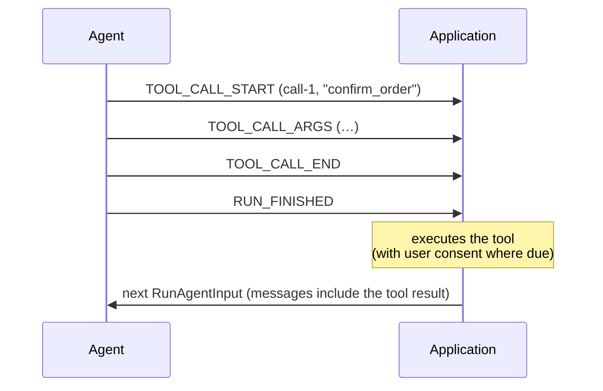

# AG-UI 设计原料摘录（抓取日期 2026-10-07）

> 来源站点：`https://docs.ag-ui.com`（Mintlify 托管，内容源于 `github.com/ag-ui-protocol/ag-ui` 开源文档）
> 抓取方式：`curl -sL https://docs.ag-ui.com/sitemap.xml` 取得 115 条 URL，再逐页请求 Mintlify 的原始 Markdown 端点（`<path>.md`，如 `https://docs.ag-ui.com/concepts/events.md`），全部返回 HTTP 200。本次共抓取 115 个页面（1.3 MB 原始 Markdown），本文件摘录其中与"抓取重点"相关的 40+ 页。
> 站点同时提供 `https://docs.ag-ui.com/llms.txt`（页面索引）与 `/spec/1.0/schema.json`（JSON Schema 源文件）。

---

## 站点地图概览（导航结构）

站点分六块。**Introduction / Agentic Protocols** 讲协议定位（Agent↔User 层，与 MCP、A2A 并列）；**Quickstart**（applications / clients / server / middleware）是面向实现者的动手教程；**Concepts**（architecture / events / agents / middleware / messages / metadata / reasoning / state / interrupts / serialization / subagents / tools / capabilities / generative-ui-specs）是概念性文档，含大量 JSON/TypeScript 示例；**Specification** 是最权威的行为规范，分 **`/spec/1.0`（冻结发布版）与 `/spec/draft`（下一版草稿，内容近乎一致但字段更多）**两套平行目录，各自下含 `architecture`、`basic`（event model / run-input / metadata / capabilities / patterns{streaming, snapshots, interrupt-resume} / transports{http-sse, http-protobuf} / processing / versioning）、`events`（按族分的 8 个页面）、`schema`（JSON Schema 渲染版，1478 行）、`changelog`；**SDK** 分 `js`（core / client / encoder / proto）、`python`（core / encoder）、`dotnet`（abstractions / client / hosting）三条线；**Development / Drafts / Integrations / Tutorials** 是贡献指南、草案（generative-ui、meta-events）与生态集成。

出处：`https://docs.ag-ui.com/introduction`、`https://docs.ag-ui.com/sitemap.xml`、`https://docs.ag-ui.com/llms.txt`

---

## 主题1：事件协议全集

### 1.1 协议的根本形态

> AG-UI is an open protocol that standardizes how agents talk to user-facing applications: **one request in, one ordered stream of typed events out**, carrying everything the user sees of the agent — text, tool calls, reasoning, shared state, progress.

- **producer**：发出事件流的任何东西（agent、proxy、bridge、test double）。
- **consumer**：读取它的任何东西（client SDK、UI、recorder、另一个 proxy）。
- 同时扮演两者的一方，两个方向分别受两套规则约束。
- **一致性按"每条流"判定**：一个 producer 在一条流上发出一个畸形 run 即不一致，无论它在别的 run 上表现如何。
- 规范权威划分是绝对的：**schema 对"结构"权威**（有哪些字段、哪些必填、什么类型、判别式可取哪些值）；**spec 正文对"行为"权威**（顺序、生命周期、归属、错误处理、兼容性）。两者冲突时，结构问题 schema 赢，行为问题本文赢。

出处：`https://docs.ag-ui.com/spec/1.0`

### 1.2 事件类型全集：**31 种，分 8 族**

`EventType` 判别式的全部 31 个值（原文枚举）：

```
TEXT_MESSAGE_START · TEXT_MESSAGE_CONTENT · TEXT_MESSAGE_END · TEXT_MESSAGE_CHUNK
TOOL_CALL_START · TOOL_CALL_ARGS · TOOL_CALL_END · TOOL_CALL_CHUNK · TOOL_CALL_RESULT
STATE_SNAPSHOT · STATE_DELTA · MESSAGES_SNAPSHOT
ACTIVITY_SNAPSHOT · ACTIVITY_DELTA
RAW · CUSTOM
RUN_STARTED · RUN_FINISHED · RUN_ERROR · STEP_STARTED · STEP_FINISHED
REASONING_START · REASONING_MESSAGE_START · REASONING_MESSAGE_CONTENT · REASONING_MESSAGE_END · REASONING_MESSAGE_CHUNK · REASONING_END · REASONING_ENCRYPTED_VALUE
SUBAGENT_STARTED · SUBAGENT_FINISHED · SUBAGENT_ERROR
```

按族分组，且每族绑定一种事件模式（pattern）与一个消费者：

| Family | Events | Pattern | Consumed by |
| - | - | - | - |
| Runs and steps | `RUN_STARTED` `RUN_FINISHED` `RUN_ERROR` `STEP_STARTED` `STEP_FINISHED` | lifecycle | the client itself |
| Text messages | `TEXT_MESSAGE_START` `TEXT_MESSAGE_CONTENT` `TEXT_MESSAGE_END` `TEXT_MESSAGE_CHUNK` | streaming | the UI |
| Tool calls | `TOOL_CALL_START` `TOOL_CALL_ARGS` `TOOL_CALL_END` `TOOL_CALL_CHUNK` `TOOL_CALL_RESULT` | streaming | the application |
| Reasoning | `REASONING_START` `REASONING_END` `REASONING_MESSAGE_START` `REASONING_MESSAGE_CONTENT` `REASONING_MESSAGE_END` `REASONING_MESSAGE_CHUNK` `REASONING_ENCRYPTED_VALUE` | streaming | the UI |
| State | `STATE_SNAPSHOT` `STATE_DELTA` `MESSAGES_SNAPSHOT` | snapshot–delta | the application store |
| Activity | `ACTIVITY_SNAPSHOT` `ACTIVITY_DELTA` | snapshot–delta | the UI |
| Subagents | `SUBAGENT_STARTED` `SUBAGENT_FINISHED` `SUBAGENT_ERROR` | lifecycle | the client itself |
| Passthrough | `RAW` `CUSTOM` | standalone | the application, opt-in |

> **Only the run lifecycle is mandatory for a producer** — every other family is a feature it emits when it has something to say with it. **A consumer MUST accept all of them**: an event from a family a consumer has no use for is still a well-formed event, not unrecognised material.

出处：`https://docs.ag-ui.com/spec/1.0/basic`、`https://docs.ag-ui.com/spec/1.0/events`、`https://docs.ag-ui.com/spec/1.0/schema#eventtype`

**关于"16 种事件类型"**：概念文档中的设计原则原文写的是 "Agents need to emit any of the **16 standardized event types** during execution"（`https://docs.ag-ui.com/concepts/architecture`）。同页列出的旧版分类只含 Lifecycle（5）+ Text（3）+ Tool Call（3）+ State（3）+ Special（2）= 16 个，不含 `*_CHUNK`、`TOOL_CALL_RESULT`、Reasoning、Activity、Subagent。`spec/1.0` 冻结版把集合扩到 31 个。两处表述并存，来源不同页。

### 1.3 事件信封（`BaseEvent`）

每个事件是共享同一信封的 JSON 对象：

| 字段 | 语义 |
| - | - |
| `type` | **REQUIRED**。判别式，`EventType` 的 31 个值之一。规范中所有规则都通过该字段挂到事件上。 |
| `timestamp` | OPTIONAL。事件创建时间。**信息性**：consumer **MUST NOT** 用它给事件排序 —— **到达顺序才是协议的顺序**。约定单位为 Unix epoch 毫秒；schema 类型是 `integer`（非 float），范围 `-9007199254740991 … 9007199254740991`。 |
| `rawEvent` | OPTIONAL。本事件翻译自的 provider 原生事件，逐字携带。consumer **MUST NOT** 由它推导协议行为。 |
| `metadata` | OPTIONAL。见 1.4。 |
| `subagentRunId` | OPTIONAL（仅 `Attributable` 类事件）。哪个 subagent invocation 产生的。缺失表示父 agent。 |

**Run-scoped 事件**（`RUN_STARTED`、`RUN_FINISHED`、`RUN_ERROR`、`MESSAGES_SNAPSHOT`）描述整个 run 或整个会话，**不携带归属**。

### 1.4 `metadata` 合并规则

`metadata` 是 open-by-key 对象，键下可放任意 JSON 值（含 `null`）。它在构建某个 item 的多个事件之间**按键累积，后写覆盖，不递归**，并由每族定义合并目标。保留键 `ag-ui`。

```typescript
{
  type: EventType.TEXT_MESSAGE_END,
  messageId: "msg_123",
  metadata: {
    "ag-ui": { usage: { input: 1200, output: 340 } },
    finishReason: "stop",
    traceId: "abc-123",
    retries: 0,
    labels: ["experimental"]
  }
}
```

- 对象本身 **要么缺失、要么是对象，永不为 `null`**；空对象合法，与省略等价。
- 键下的 `null` 值是有意义的数据，必须保留。
- 合并目标：文本消息事件 → 消息；工具调用的 `TOOL_CALL_START/ARGS/END` → **tool call 自身**（`assistantMessage.toolCalls[0].metadata`），而 `TOOL_CALL_RESULT` → 它铸出的 tool message。

出处：`https://docs.ag-ui.com/spec/1.0/basic/metadata`、`https://docs.ag-ui.com/concepts/metadata`

**"缺失即缺失"规则**：没有值的 optional 字段 **MUST** 省略，而不是发 `null`；整个 optional 字段为 `null` 必须省略。required 的 JSON 载荷可以是 `null`（例如 `CUSTOM.value`、`STATE_SNAPSHOT.snapshot`）。

### 1.5 标识符

| 标识符 | 语义 |
| - | - |
| `threadId` | 标识一次会话。由 application 铸造，跨 run 稳定。 |
| `runId` | 标识一次 run。同一 thread 上 **MUST NOT** 复用。 |
| `messageId` | 标识一条消息。**跨 run 边界**（后续 run 的 snapshot 可按键复述消息），因此在其 thread 内 **MUST** 唯一。 |
| `toolCallId` | 标识一次工具调用，把其结果、以及与之相关的 interrupt 绑回来。 |
| `subagentRunId` | 一次 subagent **invocation** 的不透明句柄，不是可复用的 subagent 定义名；同一 subagent 的两次调用携带两个不同的值。 |

所有标识符都是**不透明字符串**，consumer **MUST NOT** 从中解析结构。

### 1.6 生命周期族：run 状态机

```
stateDiagram-v2
    [*] --> Active: RUN_STARTED
    [*] --> Failed: RUN_ERROR
    Active --> Closed: RUN_FINISHED
    Active --> Failed: RUN_ERROR
    Closed --> Active: RUN_STARTED (a new run)
    Closed --> Failed: RUN_ERROR (late failure)
    Failed --> Active: RUN_STARTED (a new run)
```

硬规则：

- 流 **MUST** 以 `RUN_STARTED` 或 `RUN_ERROR` 开头。以别的事件开头 = 协议违规。`RUN_ERROR` 允许打头，因为 run 可能在开始前失败（传输层够不到 agent）。
- run 关闭后：producer **MUST NOT** 再发该 run 的任何事件，**除了** `RUN_STARTED`（开新 run）和 `RUN_FINISHED` 之后的 `RUN_ERROR`（迟到的失败，此时 consumer **MUST** 把该 run 当作失败）。`RUN_ERROR` 之后除 `RUN_STARTED` 外 **MUST NOT** 发任何东西。
- 一条流 **MAY** 顺序承载多个 run（重放线程是常见情形）。producer **MUST** 先关当前 run 再开下一个；run 仍 active 时来 `RUN_STARTED` 是违规。
- 跨 run 累积：消息累积、state 持续，除非事件替换它。重述历史 **MUST** 用 snapshot 形式（`MESSAGES_SNAPSHOT` 按 id 协调、`STATE_SNAPSHOT` 替换），re-stream 一条已有消息会**追加**而非复述 —— 所以 streaming 三元组只用于新材料。
- Run-scoped 追踪（未闭合的消息/工具调用/step/活跃 subagent）**不跨边界**；`RUN_FINISHED` 要求该 run 打开的一切都已先关闭，`RUN_ERROR` 把仍打开的一切连同 run 一起结束。新 run 从"什么都没打开"开始。

**`RUN_FINISHED.outcome`** 是判别式联合：

```typescript
type RunFinishedOutcome =
  | { type: "success" }                                        // 省略 outcome 等价于 success
  | { type: "interrupt"; interrupts: Interrupt[] }              // 暂停等人输入
  | { type: "cancelled" }                                       // 被有意停止，既非成功也非失败
type RunFinishedEvent = {
  type: "RUN_FINISHED"; threadId: string; runId: string
  result?: unknown
  outcome?: RunFinishedOutcome
  usage?: TokenUsage[]        // 每个 provider/model 一条
}
```

- `RunFinishedSuccessOutcome.pendingToolCallIds: string[]`（optional）：本次 run 发起但**未用 `TOOL_CALL_RESULT` 回答**的工具调用，按发起顺序。缺失或为空表示 producer 未列；此时 consumer 从流中自行推导（"每个发起过但没有结果的工具调用"），**MUST NOT** 把缺失读成"没有 pending"。
- **cancelled**：producer 在完成前有意停止一个 run（原因不是失败）**MUST** 用 cancelled outcome 关闭，**MUST NOT** 报成 success。被取消的 run 没有返回值（`result` SHOULD 缺失），不等任何东西，后续 run 是普通新 run 而非 resume。consumer **MUST NOT** 把它呈现为成功，也 **MUST NOT** 呈现为失败。
- consumer 主动放弃流（关连接、停止读取）拿到的是 **truncated run**，**MUST NOT** 合成本地 `RUN_FINISHED`。
- **`RUN_ERROR`** 是格式良好的事件（producer 在报告自己的失败）。`message` 人类可读；`code` OPTIONAL 机器可读开放字符串；`usage` MAY 报告失败前已累积的 token。
- **Steps**：`STEP_STARTED` / `STEP_FINISHED` 用 `stepName` 配对。**MUST NOT** 打开已打开的 step、**MUST NOT** 关闭从未打开的 step；每个打开的 step **MUST** 在 run 结束前关闭。step **MAY** 互相重叠 —— step 是"流上一段区间的标签"，不是容器。
- **Token usage 记账边界是 run**：`usage` 覆盖该 run 内**每一次**模型调用，**包含其 subagent 的调用**（subagent 事件自身不带 usage）。以独立 run 被调用的 agent（由 `parentRunId` 命名）在自己的终止事件上报告自己的 usage，父 run **MUST NOT** 把它算进自己的。resume 的 run 只报告自己做的调用。
  - `inputTokens` 是计费的每一个 prompt token（缓存与否、文本与否）；`outputTokens` 是生成的每一个 token（含 reasoning）。
  - `cachedInputTokens`（缓存读）、`cacheWriteInputTokens`（缓存写）、`reasoningTokens` 是上述总量的**组成部分，从不是增量**；两个 cache 计数互斥。
  - `totalTokens` = `inputTokens` + `outputTokens`。
  - 计数缺失 = provider 未报告；为零 = 报告了零。**MUST NOT** 为没有数据的计数发零，**MUST NOT** 把缺失读成零。

**错误处理的两个方向（consumer 必须区分）**：

- **consumer 拒绝的流** = 它检测到的协议违规（`RUN_STARTED` 前有事件、run 关闭后有事件、嵌套 `RUN_STARTED`、step 不平衡、`RUN_FINISHED` 时仍有未闭合项）→ producer 有错，流不可信。
- **run 用 `RUN_ERROR` 报告自己的失败** = 合规 producer 说它的工作没成功 → 流是良构的，consumer 接受。
- consumer **MUST NOT** 把前者呈现为后者。两种失败都保留它在失败前交付的一切。

出处：`https://docs.ag-ui.com/spec/1.0/events/lifecycle`、`https://docs.ag-ui.com/spec/1.0/schema#runfinishedevent`

### 1.7 streaming 模式（open–content–close + chunked 变体）

三个族按同一模式流式传输长值：文本消息、工具调用、reasoning 消息。两种拼写：

**A. 显式三元组**：`*_START` 打开 → 零到多个 content 事件扩展 → `*_END` 关闭；以 item 标识符配对（消息用 `messageId`，工具调用用 `toolCallId`）。

- producer **MUST NOT** 打开标识符已打开的 item。
- producer **MUST NOT** 为未打开的标识符发 content 或 end 事件。
- producer 打开的每个 item **MUST** 在 run 结束前关闭。
- 打开事件携带描述该 item 的字段；content 事件只带标识符和 `delta`。**deltas 按到达顺序拼接**成 item 的值。
- 交错自由：消息、工具调用、reasoning 消息和 steps 相互独立，producer **MAY** 自由交错（工具调用可以在消息还在流式传输时打开），只要各自遵守开闭纪律。
- 独立事件（`STATE_SNAPSHOT`、`STATE_DELTA`、`MESSAGES_SNAPSHOT`、`ACTIVITY_SNAPSHOT`、`ACTIVITY_DELTA`、`CUSTOM`、`RAW`、`REASONING_ENCRYPTED_VALUE`）不打开/关闭任何 item，**MAY** 出现在打开 run 内的任意位置。

**B. chunked 紧凑拼写**：`TEXT_MESSAGE_CHUNK`、`TOOL_CALL_CHUNK`、`REASONING_MESSAGE_CHUNK`。consumer **MUST** 在验证前、在应用代码看到之前展开成三元组，因此三元组每条规则都适用于展开后的事件。

```
sequenceDiagram
    participant Producer
    participant Expansion
    participant Consumer
    Producer->>Expansion: TOOL_CALL_CHUNK (toolCallId, toolCallName, delta)
    Expansion->>Consumer: TOOL_CALL_START
    Expansion->>Consumer: TOOL_CALL_ARGS
    Producer->>Expansion: TOOL_CALL_CHUNK (delta)
    Expansion->>Consumer: TOOL_CALL_ARGS
    Producer->>Expansion: RUN_FINISHED
    Expansion->>Consumer: TOOL_CALL_END
    Expansion->>Consumer: RUN_FINISHED
```

- **两种拼写不在一个 item 内混用**。chunk 打开的 item 以 chunk 形式继续并关闭（其 `*_END` 是合成的、从不发送）；`*_START` 打开的 item 显式继续关闭。混用 = producer **MUST NOT** 发出的畸形序列。
- **首个 chunk 的必填**：首条 `TEXT_MESSAGE_CHUNK` **MUST** 带 `messageId`（`role` 可带，缺省 assistant）；首条 `REASONING_MESSAGE_CHUNK` **MUST** 带 `messageId`；首条 `TOOL_CALL_CHUNK` **MUST** 同时带 `toolCallId` 和 `toolCallName`。缺必填字段的 chunk **MUST** 当作协议违规，而不是自造标识符。
- **续接 chunk**：带标识符的后续 chunk **MUST** 与正在续接的标识符相同（不同标识符 = 打开新 item，前一个先关闭）。续接 chunk **MAY** 重复 opener 已确立的字段（消息的 `role`/`name`、工具调用的 `toolCallName`/`parentMessageId`），但**值必须相同**；**冲突性重复 MUST 视为协议违规** —— 包括与"靠省略确立的值"冲突（无 role 打开的消息是 assistant，后续 chunk 声明别的 role 即矛盾）。
- **chunk 流的关闭（consumer 合成 `*_END`）时机**：同 lane 内某个 chunk 打开了不同 item；同 lane 来了 message/tool-call/step/state/custom/reasoning 事件 —— **四个例外**站位不参与装配也不关闭任何东西：`RAW`、`ACTIVITY_SNAPSHOT`、`ACTIVITY_DELTA`、`REASONING_ENCRYPTED_VALUE`（以及 `SUBAGENT_STARTED`，它开新 lane）；来了 run 级事件 `RUN_STARTED`/`RUN_FINISHED`/`RUN_ERROR`/`MESSAGES_SNAPSHOT`（关闭所有 lane）；或该 item 归属的 subagent 终止（关闭该 subagent 的 lane）。
- **lane 归属**由归属规则决定；对既无标识符也无 tag 的续接 chunk，按解析规则：优先续接父 agent 已打开的同种流，否则续接**唯一**打开的同种流。当若干 lane 都有同种打开流且都不是父 agent 的，该续接**无唯一指涉**，**MUST** 以 ambiguous 拒绝。chunk 流 **MUST NOT** 比其 owner 活得更久。
- **chunk metadata**：chunk 的 `metadata` 适用于由它合成的事件，并按 metadata 规则合并进 item。只带 metadata 的续接 chunk（最后一个 chunk 报告 usage 和 finish reason）合法。

出处：`https://docs.ag-ui.com/spec/1.0/basic/patterns/streaming`

### 1.8 文本消息族（JSON 原文示例）

```json
{ "type": "TEXT_MESSAGE_START", "messageId": "msg-1", "role": "assistant" }
```
```json
{ "type": "TEXT_MESSAGE_CONTENT", "messageId": "msg-1", "delta": "Hello, world." }
```
```json
{ "type": "TEXT_MESSAGE_END", "messageId": "msg-1" }
```

- `role` OPTIONAL，缺失含义为 `assistant`（该含义是规范性的）。`name` OPTIONAL，在同一 role 内标注说话者。
- `TEXT_MESSAGE_CONTENT.delta` 按到达顺序拼接。
- **关闭的消息是"关闭"而非"封存"**：producer **MAY** 用新的 `TEXT_MESSAGE_START` 重开同一 `messageId`，消息继续，后续内容追加到已有内容之后。重开的 start **MUST** 与其重开的消息一致（同一 owner、同一 `role`、同一 `name`）；消息已确立的值成立。后续 `MESSAGES_SNAPSHOT` **MAY** 整体复述该消息。
- `TEXT_MESSAGE_CHUNK` 的展开规则见 1.7。
- **错误处理**：对未打开的 `messageId` 发 content/end，或对已打开的 id 发 start，是畸形序列、对 run 致命；run 结束时消息仍打开同样是违规。

消息流：

```
sequenceDiagram
    participant Agent
    participant Client
    participant UI
    Agent->>Client: TEXT_MESSAGE_START (msg-1, assistant)
    Client->>UI: new message appears
    loop streaming
        Agent->>Client: TEXT_MESSAGE_CONTENT (delta)
        Client->>UI: text grows
    end
    Agent->>Client: TEXT_MESSAGE_END (msg-1)
    Client->>UI: message complete
```

组装后的消息在历史中按 role 呈现为 `AssistantMessage` / `UserMessage` / `SystemMessage` / `DeveloperMessage`。

出处：`https://docs.ag-ui.com/spec/1.0/events/text-messages`

### 1.9 工具调用族（JSON 原文示例）

```json
{
  "type": "TOOL_CALL_START",
  "toolCallId": "call-1",
  "toolCallName": "search",
  "parentMessageId": "msg-1"
}
```
```json
{
  "type": "TOOL_CALL_RESULT",
  "messageId": "msg-2",
  "toolCallId": "call-1",
  "content": "3 results found."
}
```

- `toolCallName` 命名被调用的工具；`parentMessageId` OPTIONAL，把调用挂到承载它的 assistant 消息上。当父消息归属某个 subagent 时，调用 **MUST** 与该归属一致。
- `TOOL_CALL_ARGS.delta` 拼接成调用的参数文本，**约定**是 JSON 文档，但协议按文本携带、**不校验** —— 这是刻意的：provider 会发畸形参数字符串，由 application 决定怎么处理，好过传输层杀掉 run。**consumer MUST NOT 在 `TOOL_CALL_END` 之前对参数采取行动**（关闭前该文本是前缀，不是东西本身）。
- `TOOL_CALL_END` 表示参数文本**完整**，不是**有效**。
- 关闭的调用可被同 `toolCallId` 的新 `TOOL_CALL_START` 重开，后续参数追加；重开的 start **MUST** 与之一致（同 `toolCallName`、同 `parentMessageId`、同 owner）。
- `TOOL_CALL_RESULT` **本身是一条消息**（tool message，有自己的 `messageId`），不复述它回答的调用。结果 **MAY** 与调用在同一 run 到达（agent 侧执行的工具），或**从不在流中出现**（client 执行的工具，其结果作为 tool message 出现在下一个 run 的 input 中）。
- `content` **MUST** 是 string 或有序的 `ContentPart` 列表（`text`/`image`/`audio`/`video`/`document`，每个媒体 part 带 `source`：inline `data`、`url` 或 provider 的 `file` 句柄）。事件铸出的 tool message 形状完全相同，因此结果可原样进入下一个 run 的 `messages`。多模态结果示例：

```json
{
  "type": "TOOL_CALL_RESULT",
  "messageId": "msg-2",
  "toolCallId": "call-1",
  "content": [
    { "type": "text", "text": "Invoice INV-2291 attached." },
    {
      "type": "document",
      "source": { "type": "url", "value": "https://example.com/INV-2291.pdf", "mimeType": "application/pdf" },
      "metadata": { "title": "INV-2291" }
    }
  ]
}
```

- 工具返回结构化数据（如 JSON 对象）时序列化成字符串形式或一个 `text` part —— **协议没有 JSON part**。
- part 没建模的东西（搜索命中的来源与标题、文档文件名）放在该 part 的 `metadata` 里。协议不定义 provider 专有的结果块。
- 工具把输出上传到 model provider 后，返回 `file` 源句柄而非重发字节；consumer 把句柄当不透明。
- producer 拿到其模型不能接受的 part（纯文本模型收到图片等）**MUST NOT** 因此让 run 失败：丢弃该 part 并继续，且 **MUST** 仍然回答这次调用 —— 每个 part 都被丢弃的结果用**空字符串**回答，因为未回答的工具调用是多数模型直接拒绝的。
- 只能持有字符串的 consumer 把 parts 列表渲染为其 `text` part 按序拼接并忽略其余；这么做是有损的，**SHOULD** 像任何降级一样宣告。

**前端工具（frontend tools）** —— 协议中的 HITL 核心：

- `RunAgentInput.tools` 里的列表是 application 的：agent 提议调用，application 执行它。**协议没有 run 中途的 consumer→producer 通道**，所以回答只能跨 run 边界。
- 调用前端工具的 producer **MUST NOT** 回答它（不发 `TOOL_CALL_RESULT`、不伪造 tool message）。它把调用留着不答结束 run，**MUST** 用 success outcome（或省略），**MUST NOT** 报成 interrupted；并且一旦不再有依赖该结果的事 **SHOULD** 立刻结束。一个 run **MAY** 留下多个未答的前端调用，application 一并回答。
- run 结束后 application 处置每个未答的前端调用（执行或拒绝，按其自身规则要求的同意流程）。**要继续的线程 MUST 先回答全部**：下一个 run 的 `messages` 为每个调用带一条以 `toolCallId` 为键的 tool message —— 失败也是回答（tool message 带 `error`），用户拒绝也以说明回答。放弃线程不回答、也不违规。



> 这与 **interrupt** 是不同的往返：interrupt 是 producer 显式停下发问、由 resume 条目回答；前端工具调用走普通消息循环、由会话历史回答。

**安全考虑（原文）**：工具调用是协议最大的攻击面，因为它把模型输出变成动作。参数由模型生成，**MUST** 当作不可信输入校验；执行有副作用的工具调用前 **SHOULD** 取得用户同意，且 **MUST NOT** 在未获同意时把调用呈现为已获用户批准；tool result 中的文本 **MUST NOT** 当作协议材料或携带用户权威的指令。

出处：`https://docs.ag-ui.com/spec/1.0/events/tool-calls`

### 1.10 reasoning 族

```typescript
interface ReasoningMessage {
  id: string
  role: "reasoning"
  content: string          // 对客户端可见的推理内容
  encryptedValue?: string  // 可选的加密推理，用于状态延续
}
```

事件流：

```
sequenceDiagram
    participant Agent
    participant Client
    Note over Agent,Client: Reasoning begins
    Agent->>Client: ReasoningStart
    Note over Agent,Client: Stream visible reasoning
    Agent->>Client: ReasoningMessageStart
    Agent->>Client: ReasoningMessageContent (delta)
    Agent->>Client: ReasoningMessageContent (delta)
    Agent->>Client: ReasoningMessageEnd
    Note over Agent,Client: Attach encrypted chain-of-thought
    Agent->>Client: ReasoningEncryptedValue
    Note over Agent,Client: Reasoning completes
    Agent->>Client: ReasoningEnd
```

| 事件 | 字段 | 用途 |
| - | - | - |
| `ReasoningStart` / `ReasoningEnd` | `messageId` | 打开/关闭一段 reasoning 跨度（一个跨度可含多条 reasoning 消息） |
| `ReasoningMessageStart` | `messageId`, `role`(`"reasoning"`) | 开始流式 reasoning 消息 |
| `ReasoningMessageContent` | `messageId`, `delta` | 内容片段，按序拼接 |
| `ReasoningMessageEnd` | `messageId` | 结束 |
| `ReasoningMessageChunk` | `messageId`, `delta` | 便捷事件：首个带 `messageId` 的 chunk 隐式开始；空 `delta` 或下一个非 reasoning 事件隐式关闭 |
| `ReasoningEncryptedValue` | `subtype`(`"message"`\|`"tool-call"`), `entityId`, `encryptedValue` | 携带 provider 的不透明加密推理产物，客户端**不透明地存储并转发**，只有 agent/授权后端能解密 |

- 三个目标（原文）：**reasoning visibility**（在不暴露原始 CoT 的前提下把推理信号如摘要呈现给用户）、**state continuity**（用加密推理项跨轮次保持推理上下文，即使 `store:false` 或零数据保留 ZDR）、**privacy compliance**。
- 与 Activity 消息不同，reasoning 消息**要**在后续轮次送回 agent 继续处理。
- 已废弃：`THINKING_*` 五个事件 → 对应 `REASONING_*`：

| Deprecated | Replacement |
| - | - |
| `THINKING_START` | `REASONING_START` |
| `THINKING_END` | `REASONING_END` |
| `THINKING_TEXT_MESSAGE_START` | `REASONING_MESSAGE_START` |
| `THINKING_TEXT_MESSAGE_CONTENT` | `REASONING_MESSAGE_CONTENT` |
| `THINKING_TEXT_MESSAGE_END` | `REASONING_MESSAGE_END` |

出处：`https://docs.ag-ui.com/spec/1.0/events/reasoning`、`https://docs.ag-ui.com/concepts/reasoning`、`https://docs.ag-ui.com/concepts/events#reasoning-events`、`https://docs.ag-ui.com/spec/1.0/schema#reasoningencryptedvalueevent`

### 1.11 activity 族（结构化进度，非会话内容）

```json
{
  "type": "ACTIVITY_SNAPSHOT",
  "messageId": "act-1",
  "activityType": "web_search",
  "content": { "query": "…", "found": 3 }
}
```

- `activityType` 是**开放字符串**：集合属于 producer，不属于协议；consumer **MUST** 容忍不认识的类型。
- 未见过 `messageId` 的 snapshot 创建 activity 消息，序列位置在到达点。已有活动消息的 snapshot **替换其 content 与 `activityType`**；`replace` OPTIONAL，**缺失即替换（该含义是规范性的）**，显式 `replace: false` 要求 consumer 保持既有消息原样（content 和 `activityType` 都保持），snapshot 自己的值仅在创建时生效 —— **不是合并**。替换的是 **content**，不是已累积的 metadata。归属例外：替换性 snapshot 会重新铸造消息，其 `subagentRunId` 变为 snapshot 自己的。
- `ACTIVITY_DELTA` 用 RFC 6902 patch 修改某条 activity 消息的 `content`；其 `activityType` 会**替换**消息的（delta **MAY** 改类型，不想改就必须重复当前类型，因为该字段必填）。
  - producer **MUST NOT** 对没用 snapshot 创建过的 activity 消息发 delta。
  - delta 指名的消息不存在或不是 activity 消息 → **跳过**，consumer SHOULD 警告，**MUST NOT** 让 run 失败。
  - patch 结果 **MUST** 仍是对象。
- activity 消息在历史中 role 固定为 `"activity"`，是渲染材料而非 agent 继续的会话：consumer **MUST** 在发送的 `messages` 中剥离它们。
- **id 空间共享**：activity 消息的 `messageId` 不得被文本或 reasoning 消息复用（反之亦然）—— 它们的 `content` 形状不同（结构化对象 vs 字符串）。

```typescript
interface ActivityMessage {
  id: string
  role: "activity"
  activityType: string             // e.g. "PLAN", "SEARCH", "SCRAPE"
  content: Record<string, any>     // 由前端渲染的结构化载荷
}
```

出处：`https://docs.ag-ui.com/spec/1.0/events/activity`、`https://docs.ag-ui.com/concepts/messages`、`https://docs.ag-ui.com/concepts/events#activity-events`

### 1.12 subagent 族（归属）

- `subagentRunId` 标识一次 invocation；subagent 产生的事件携带它，父 agent 的不携带。**缺失表示父 agent，且 MUST NOT 写成 `null`**。
- 一个 id 标识 **invocation**，不是 agent。producer **MUST NOT** 在 run 内为第二次 invocation 复用 `subagentRunId`（即使是同一个 subagent）；id **MAY** 在后续 run 中重现（续接一个被挂起的 invocation）。
- 生命周期：`SUBAGENT_STARTED` 宣布、`SUBAGENT_FINISHED` 关闭、`SUBAGENT_ERROR` 报告失败。三者都携带所涉 `subagentRunId`，producer **MUST NOT** 省略。producer **MUST NOT** 宣布已 active 的 id，**MUST NOT** 复用本 run 中已结束的 id；每个宣布的 invocation **MUST** 在 run 结束前由 `SUBAGENT_FINISHED` 或 `SUBAGENT_ERROR` 关闭。
- producer **MAY** 只携带归属而不宣布生命周期；consumer **MUST** 接受这种流。
- `SUBAGENT_ERROR` 结束的是 invocation 而非 run —— 父 agent 可以处理失败并继续，这就是它不是 `RUN_ERROR` 的原因。
- subagent 的模型调用属于该 run：任何 subagent 事件都不带 token usage。
- `SUBAGENT_FINISHED.outcome` 判别式：

```typescript
type SubagentFinishedOutcome =
  | { type: "success" }                                        // 省略等价于 success
  | { type: "suspended"; interruptIds?: string[] }             // 挂起等外部输入
```

- **归属即所有权**：实体在某 owner 下打开后，续接它的每个事件 **MUST** 对该 owner 一致。`TEXT_MESSAGE_CONTENT`/`TEXT_MESSAGE_END` **MUST NOT** 携带与打开它的 `TEXT_MESSAGE_START` 相冲突的 `subagentRunId`（**MAY** 省略 tag，无 tag 的续接继承 opener 的 owner）。reasoning 消息、工具调用（相对 `TOOL_CALL_START`）、activity 消息（相对打开它的 snapshot）同理。`STEP_FINISHED` **MUST** 携带与它所关闭的 `STEP_STARTED` 相同的归属 —— step 是 per-owner 的，父与 subagent **MAY** 同时各有同名 step 打开。**consumer MUST 拒绝 tag 与 opener 冲突的续接**（接受它会把一个 producer 的内容追加进另一个 producer 的消息，事后无法检测）；不带 tag 的续接不是冲突，**MUST** 被接受。
- 工具调用**继承承载它的消息的归属**。
- **嵌套与并行**：`parentSubagentRunId` 命名孵化它的 invocation；缺失表示父 agent 直接孵化。producer **MUST NOT** 命名本 run 中未宣布的父 invocation。invocation **MAY** 并行、事件 **MAY** 任意交错；consumer **MUST NOT** 假设某 invocation 的事件连续，**MUST NOT** 因另一个 invocation 结束而关闭它的实体。
- **State 是 run-scoped**：subagent 发的 `STATE_SNAPSHOT`/`STATE_DELTA` 与父 agent 发的一样更新**该 run 的** state；`subagentRunId` 在 state 事件上是**来源标记（provenance），不是所有权**。**本协议没有 per-subagent state**。
- **终止**：run **MUST NOT** 在某个 invocation 仍 active 时结束。`RUN_ERROR` 结束一切 —— consumer **MUST** 把每个打开的 invocation 当作被放弃，且 **MUST NOT** 期待其关闭事件。

`SUBAGENT_STARTED` 字段：`subagentRunId`(必填)、`name`(必填，跨 invocation 可复用)、`description`、`parentSubagentRunId`、`parentToolCallId`、`parentMessageId`。

出处：`https://docs.ag-ui.com/spec/1.0/events/subagents`、`https://docs.ag-ui.com/concepts/events#subagent-events`、`https://docs.ag-ui.com/spec/1.0/schema#subagentstartedevent`

### 1.13 passthrough 族（两个逃生口）

```json
{ "type": "RAW", "event": { "…the provider's own event…": true }, "source": "openai" }
```
```json
{ "type": "CUSTOM", "name": "com.example.cart-updated", "value": { "items": 3 } }
```

- `RAW.event` **REQUIRED**（任意 JSON 值），`source` OPTIONAL。consumer **MUST NOT** 从 `RAW` 推导协议行为 —— 它里面的东西不打开、关闭或修改本规范追踪的任何东西。producer **SHOULD** 与标准事件**并列**发 `RAW`，绝不**替代**它们。
- `CUSTOM.name` 与 `CUSTOM.value` 都 **REQUIRED**。不认识 `name` 的 consumer **MUST 忽略该事件** —— 这是协议合法流量，不属于"unrecognised material"，不 strip、不警告。名字是 application 空间，producer **SHOULD** 用厂商/应用前缀避免冲突；无前缀的名字保留给协议未来使用。producer **MUST NOT** 依赖一个 `CUSTOM` 事件承载本规范已指派给标准事件的语义。
- 安全：passthrough 内容按定义未经校验，consumer **MUST** 当作不可信输入。

出处：`https://docs.ag-ui.com/spec/1.0/events/passthrough`

### 1.14 处理模型：什么存活、什么致命

**规则（原文）**：*Unrecognised material is not an error. A malformed known value is.*

- 本实现不认识的事件类型 **MUST NOT** 中止 run。
- 事件上未描述的属性 **MUST NOT** 中止 run。
- 不认识的联合成员（新类型 content part、发布后才命名的 outcome）**MUST NOT** 中止 run。
- 协议**确实**描述、但值被 schema 拒绝的字段 **MUST** 致命：consumer **MUST** 让 run 失败，而不是修复、强转或忽略。

处置方式：

- **丢弃**（整个事件类型不认识）——SHOULD 发警告指名类型。
- **剥离**（已知事件上的未知属性或不认识的联合成员）——SHOULD 发警告指名被移除的路径。
- 剥离深入到底：**optional** 位置 → 移除该字段、周围全存活；**required** 位置 → 移除**包含**它的那个值（例如 source 类型不认识的媒体 part 整体移除）；**列表内** → 丢掉不可识别的元素、列表存活。
- **开放对象例外**：JSON Patch 操作是 open object，RFC 6902 §4 要求忽略未定义成员而非拒绝，所以在那里剥离会删除合规数据。

**流水线顺序（承重）**：

```
producer → compatibility boundary → middleware → enforcement
         → chunk expansion → verification → application
```

- middleware **MUST** 在 enforcement 之前运行（shim 存在正是为了翻译当前协议未描述的形状；若 enforcement 先剥离，shim 拿到的就没有东西可翻译了）。
- application 代码 **MUST NOT** 看到 enforcement 会移除的材料。
- 兼容边界最先看到流（退役形状可能是 chunk）。middleware **链 MAY** 在自己的阶段之间展开 chunk，因此 middleware **MUST** 对两种形式都有准备。
- verification **MUST** 在展开之后运行（它检查的"消息和调用先开后继续后关闭"只有在 chunk 变成事件后才存在）。
- chunk 本身是独立事件，**MUST** 被当作独立事件判断：先遇到畸形 chunk 的阶段 **MUST** 拒绝而非修复，**MUST NOT** 规范化、补默认值或掩盖。
- 出方向同理：consumer 在发送前 **MUST** 移除 run input 中不认识的素材、SHOULD 警告、遇畸形已知字段 **MUST** 在发送前致命。
- producer **MUST NOT** 发出协议未描述的事件类型并指望 consumer 忽略它。

出处：`https://docs.ag-ui.com/spec/1.0/basic/processing`

### 1.15 版本与兼容

- **默认即加法安全**：协议靠"增加"演进（新事件类型、新 optional 字段、开放联合的新成员）。所有加法 **MUST** 对旧方安全。
- **降级（downgrade）**：知道对端较旧的一方 **MAY** 翻译；降级移除或重塑，**MUST NOT** 发明含义（可用空值重塑，**MUST NOT** 提供 producer 从未发过的非空值）。降级 **MUST NOT** 顺手修复畸形值。
  - **无损**（移除的东西旧方无法据此行动，如剥掉不认识 subagent 的对端的 `subagentRunId`）→ **MAY** 静默。
  - **有损**（丢掉承载含义的内容）→ **MUST** 发警告，指明丢了什么、为什么，SHOULD 说明升级到什么可消除。
- **退役形状（retired shapes）**：**MUST** 记录在 deprecation registry（含替代物、翻译所在、翻译本身何时过期）；consumer **SHOULD** 翻译而非丢弃；翻译 **MUST** 作为 middleware 运行。
- **版本协商在带内**：
  - consumer 在 `RunAgentInput.protocolVersion` 声明自己说的版本。
  - producer 在 `RUN_STARTED.protocolVersion` 声明**它自己**的版本（绝不是回声）。这一对就是全部协商。
  - 两字段在 schema 中 optional，因为缺失本身有意义：来自协议尚未携带版本之前的对端。
  - 值是 `MAJOR.MINOR`，**逐分量数值比较**（`1.10` 比 `1.9` 新）。
  - producer 遇到"它所实现产品线的新 minor" **MUST** 服务该 run，并 **SHOULD** 警告；**MAY** 在 `RUN_STARTED` 之前拒绝的，只有它未实现的 major 线的声明。
  - 声明命名的是该 run 的流"说什么"，不是谁在转发它；一条流承载多个 run 时，每个 `RUN_STARTED` 声明自己的 run。

出处：`https://docs.ag-ui.com/spec/1.0/basic/versioning`

---

## 主题2：State Snapshot vs State Delta（共享状态同步）

### 2.1 共享状态的定义

> 在 AG-UI 中，state 是一个结构化数据对象，它：1) 跨与 agent 的交互持续存在；2) 可被 agent 和前端同时访问；3) 随交互进展实时更新；4) 为双方的决策提供上下文。

这形成双向通道：agent 可读取 application 当前 state 做决策；前端可观察并响应 agent 内部 state 的变化；**双方都可以修改 state**。

出处：`https://docs.ag-ui.com/concepts/state`

### 2.2 snapshot 与 delta 的语义

**`STATE_SNAPSHOT`** — 整体替换 agent state。

```typescript
interface StateSnapshotEvent {
  type: EventType.STATE_SNAPSHOT
  snapshot: any // Complete state object
}
```

- consumer **MUST** 用 `snapshot` 替换自己的 state —— **不合并**。
- 它之前的任何 delta 都作废：snapshot（无论被应用还是被拒绝）就是新的基线时刻。
- producer **MAY** 在任何时刻发 snapshot，且**在无法保证 consumer 基线与自身一致时 SHOULD 发**：错误之后、delta 无法表达的变化、续接旧 thread 的 run 开始时。
- 典型使用时机：交互开始建立初始 state；连接中断后同步；发生需要整体刷新的重大变化；为未来 delta 建立新基线。

**`STATE_DELTA`** — 用 RFC 6902 JSON Patch 修改当前 state。

```typescript
interface StateDeltaEvent {
  type: EventType.STATE_DELTA
  delta: JsonPatchOperation[] // Array of JSON Patch operations
}
```

- 基线是 consumer 的当前 state：run 开始时是 input 的 `state`（若 input 未带则是空对象 `{}`）；之后是该 run 自己的 snapshot 与 delta 造成的结果。
- 操作**按顺序、原子地**应用 —— 任一步失败，文档保持原样。
- producer **MUST NOT** 对它没给过 consumer 基线的值发 delta。
- Patch 操作**刻意是开放对象**：schema 如此标记，RFC 6902 未定义但在成员里的东西是协议合法材料，处理模型 **MUST NOT** 剥离。

```typescript
interface JsonPatchOperation {
  op: "add" | "remove" | "replace" | "move" | "copy" | "test"
  path: string    // JSON Pointer (RFC 6901)
  value?: any     // for add, replace
  from?: string   // for move, copy
}
```

操作示例（原文）：

```json
{ "op": "add", "path": "/user/preferences", "value": { "theme": "dark" } }
{ "op": "replace", "path": "/conversation_state", "value": "paused" }
{ "op": "remove", "path": "/temporary_data" }
{ "op": "move", "path": "/completed_items", "from": "/pending_items/0" }
```

`JsonPointer` 类型约束（原文）：`string matching ^(/([^/~]|~[01])*)*$`。空字符串表示整个文档；`~` 转义为 `~0`、`/` 转义为 `~1`；没有前导斜杠、或 `~` 后不是 `0`/`1` 的，不是 JSON Pointer。

`State` 类型：**任意 JSON 值** —— 对象、数组、字符串、数字都合法（协议携带 state 而不解释它）。

### 2.3 patch 不适用时（snapshot–delta 模式的失败处理）

- **结构不良的操作**（patch 不是数组、操作缺必填成员或类型错误）= 畸形已知值，**致命**。
- **`op` 命名了 RFC 6902 未定义的东西** = 不是畸形而是**不识别**（消费者发布后才加入的判别式联合成员）→ 按处理模型的列表规则：该元素**带警告从 patch 中丢弃，run 存活**。
- **良构但应用失败**（指向不存在的路径；`test` 操作失败）：
  - consumer **MUST NOT** 保留部分应用的结果（RFC 6902 应用是原子的）。
  - consumer **MUST** 暴露该失败（一条足以诊断的警告，指明失败内容与原因），**MAY** 保持先前值继续而不让 run 失败。
  - 从此刻起 consumer 的值可能与 producer 的分歧。producer 得知或无法排除时 **SHOULD** 用 snapshot 重新同步；consumer **MUST** 无条件采纳下一个 snapshot —— 这正是恢复可行的原因。

```
sequenceDiagram
    participant Producer
    participant Consumer
    Producer->>Consumer: STATE_SNAPSHOT {"items": []}
    Producer->>Consumer: STATE_DELTA add /items/0
    Producer->>Consumer: STATE_DELTA replace /items/0/status
    Note over Consumer: a delta fails to apply → warn, keep prior value
    Producer->>Consumer: STATE_SNAPSHOT (resynchronises)
```

### 2.4 参考实现的落地细节

原文档给出的 TS 实现片段（`fast-json-patch`）：

```typescript
case EventType.STATE_DELTA: {
  const { delta } = event as StateDeltaEvent;
  try {
    // Apply the JSON Patch operations to the current state without mutating the original
    const result = applyPatch(state, delta, true, false);
    state = result.newDocument;
    return emitUpdate({ state });
  } catch (error: unknown) {
    console.warn(
      `Failed to apply state patch:\n` +
      `Current state: ${JSON.stringify(state, null, 2)}\n` +
      `Patch operations: ${JSON.stringify(delta, null, 2)}\n` +
      `Error: ${errorMessage}`
    );
    return emitNoUpdate();
  }
}
```

该实现保证：patch 原子应用（全有或全无）；应用过程中原 state 不被 mutate；错误被捕获并优雅处理。

### 2.5 跨 run 行为

State 在 thread 上跨 run 持续，直到某事件替换它；下一个 run 的 input 把它作为起始值带回 —— 这就是让双方保持一致的循环。消息以同样方式累积。

```
sequenceDiagram
    participant Agent
    participant Application
    Agent->>Application: STATE_SNAPSHOT {"draft": {"sections": []}}
    Agent->>Application: STATE_DELTA (add /draft/sections/0)
    Agent->>Application: STATE_DELTA (replace /draft/sections/0/status)
    Agent->>Application: RUN_FINISHED
    Application->>Agent: next RunAgentInput (state: the current value)
```

### 2.6 安全

state 事件是**对 application state 的远程写入**。application **MUST** 在据此行动（渲染、执行、因为 state 而授予任何东西）之前校验它从 state 读出的内容；producer **SHOULD NOT** 把秘密放进 state（它会经由 consumer 往返并在每个 run 回来）。

### 2.7 Activity 也走 snapshot–delta，但有 `replace: false` 例外

snapshot–delta 模式被两个族使用：state（`STATE_SNAPSHOT`、`STATE_DELTA`，以及用于会话的 `MESSAGES_SNAPSHOT`）与 activity（`ACTIVITY_SNAPSHOT`、`ACTIVITY_DELTA`）。snapshot **MUST** 替换（不是合并），**除非 snapshot 自己通过其族定义的某字段选择退出** —— activity 的 `replace: false` 是唯一一例。

出处：`https://docs.ag-ui.com/spec/1.0/basic/patterns/snapshots`、`https://docs.ag-ui.com/spec/1.0/events/state`、`https://docs.ag-ui.com/concepts/state`、`https://docs.ag-ui.com/spec/1.0/schema#state`

---

## 主题3：Tool-based Generative UI

### 3.1 协议定位：AG-UI 本身不是生成式 UI 规范

> Despite the naming similarities, **AG-UI is not a generative UI specification** — it's a **User Interaction protocol** that provides the **bi-directional runtime connection** between the agent and the application. AG-UI natively supports all of the above generative UI specs and allows developers to define **their own custom generative UI standards** as well.

并列的三个生成式 UI 规范（原文表格）：

| Specification | Origin / Maintainer | Purpose |
| - | - | - |
| **A2UI** | Google | A declarative, LLM-friendly Generative UI spec. JSONL-based and streaming, designed for platform-agnostic rendering. |
| **Open-JSON-UI** | OpenAI | An open standardization of OpenAI's internal declarative Generative UI schema. |
| **MCP-UI** | Microsoft + Shopify | A fully open, iframe-based Generative UI standard extending MCP for user-facing experiences. |

出处：`https://docs.ag-ui.com/concepts/generative-ui-specs`、`https://docs.ag-ui.com/agentic-protocols`

### 3.2 基础机制：工具在前端定义、随 run 传给 agent

```typescript
interface Tool {
  name: string          // 工具唯一标识
  description: string   // 人类可读说明
  parameters: {         // JSON Schema 描述参数
    type: "object"
    properties: { /* Tool-specific parameters */ }
    required: string[]
  }
}
```

```typescript
// 在前端定义工具
const userConfirmationTool = {
  name: "confirmAction",
  description: "Ask the user to confirm a specific action before proceeding",
  parameters: {
    type: "object",
    properties: {
      action: { type: "string", description: "The action that needs user confirmation" },
      importance: { type: "string", enum: ["low", "medium", "high", "critical"], description: "The importance level of the action" },
    },
    required: ["action"],
  },
}

// 在运行时把工具传给 agent
agent.runAgent({ tools: [userConfirmationTool], /* Other parameters... */ })
```

原文列出的收益：**Frontend control**（前端决定 agent 可用哪些能力）、**Dynamic capabilities**（可按权限/上下文/应用状态增删）、**Separation of concerns**（agent 专注推理，前端实现工具）、**Security**（敏感操作由 application 控制，不由 agent 控制）。

**边界规则（原文）**：`RunAgentInput.tools` 只用于这些 client 提供的工具，**不**用于装后端 agent 可用的全部工具。后端私有工具应在其框架里定义、或通过 agent capabilities 声明，而**不是**从客户端发 schema。

**工具调用生命周期（原文 TS 示例）**：

```typescript
// 1. ToolCallStart
{ type: EventType.TOOL_CALL_START, toolCallId: "tool-123", toolCallName: "confirmAction", parentMessageId: "msg-456" }
// 2. ToolCallArgs —— 流式 JSON 片段
{ type: EventType.TOOL_CALL_ARGS, toolCallId: "tool-123", delta: '{"act' }
{ type: EventType.TOOL_CALL_ARGS, toolCallId: "tool-123", delta: 'ion":"Depl' }
{ type: EventType.TOOL_CALL_ARGS, toolCallId: "tool-123", delta: 'oy the application to production"}' }
// 3. ToolCallEnd
{ type: EventType.TOOL_CALL_END, toolCallId: "tool-123" }
```

前端累积这些 delta 得到完整参数；调用完成后前端可执行工具并把结果回传 agent。

**工具结果作为 tool message**：

```typescript
{ id: "result-789", role: "tool", content: "true", toolCallId: "tool-123" }
```

失败时设 `error`：

```typescript
{
  id: "result-789", role: "tool",
  content: "Deployment blocked: the production environment is locked",
  toolCallId: "tool-123",
  error: "the production environment is locked"   // 标记该结果为失败
}
```

> `error` 是协议表达"客户端工具失败"的方式。没有它，失败的工具与成功工具无法区分 —— 前端放进 `content` 的东西就是 agent 能拿到的全部。

**工具元数据落在 tool call 上而非父消息上**（原文理由）：一条 assistant 消息可以拥有多个工具调用，把它们的元数据折进父消息会让结果取决于调用的交错顺序；给每个工具调用自己的元数据使它无歧义。

出处：`https://docs.ag-ui.com/concepts/tools`

### 3.3 草案：`generateUserInterface` 两步生成法

> **Problem Statement**: Currently, creating custom user interfaces for agent interactions requires programmers to define specific tool renderers. This limits the flexibility and adaptability of agent-driven applications.
> **Motivation**: This draft describes an AG-UI extension that addresses **generative user interfaces** — interfaces produced directly by artificial intelligence without requiring a programmer to define custom tool renderers. The key idea is to leverage our ability to send client-side tools to the agent, thereby enabling this capability across all agent frameworks supported by AG-UI.

- **Status**: Draft；**Author(s)**: Markus Ecker (mail@mme.xyz)

```
flowchart TD
    A[Agent needs UI] --> B["Step 1: What?<br/>Agent calls generateUserInterface<br/>(description, data, output)"]
    B --> C["Step 2: How?<br/>Secondary generator builds actual UI<br/>(JSON Schema, React, etc.)"]
    C --> D[Rendered UI shown to user]
    D --> E[Validated user input returned to Agent]
```

**Step 1：注入到 agent 的轻量工具**

- **Name**: `generateUserInterface`
- **Arguments**:
  - **description**：UI 的高层描述（如 "A form for entering the user's address"）
  - **data**：预填充到生成 UI 的任意数据
  - **output**：agent 期望用户回传的数据的描述或 schema（字段、必填/可选、类型、约束）

工具调用示例（原文）：

```json
{
  "tool": "generateUserInterface",
  "arguments": {
    "description": "A form that collects a user's shipping address.",
    "data": { "firstName": "Ada", "lastName": "Lovelace", "city": "London" },
    "output": {
      "type": "object",
      "required": ["firstName","lastName","street","city","postalCode","country"],
      "properties": {
        "firstName": { "type": "string", "title": "First Name" },
        "lastName": { "type": "string", "title": "Last Name" },
        "street": { "type": "string", "title": "Street Address" },
        "city": { "type": "string", "title": "City" },
        "postalCode": { "type": "string", "title": "Postal Code" },
        "country": { "type": "string", "title": "Country", "enum": ["GB","US","DE","AT"] }
      }
    }
  }
}
```

**Step 2：把 UI 生成委托给第二个 LLM 或 agent**

- CopilotKit 用户保持控制权：可做自己的生成器、加自定义库、加额外 prompt 等。
- 工具被调用时，第二个模型消费 `description`、`data`、`output` 生成用户界面。
- 该模型**只专注 UI 生成**，以保证最大保真度与一致性。
- 生成方式可替换（JSON、HTML 或其他可渲染格式）。
- UI 格式描述**不受结构或长度约束**，可支持任意复杂的规格。

**挑战与限制（原文）**：

- **Tool Description Length**：OpenAI 对工具描述强制 1024 字符上限；Gemini 与 Anthropic 无此限制。
- **Arguments JSON Schema Constraints**：跨 LLM provider，类、嵌套、`$ref`、`oneOf` **不可靠支持**。
- **Context Window Considerations**：把大型 UI 描述语言注入 agent 可能降低其性能；**专用于 UI 生成的 agent 比同时兼顾 UI 生成与其他任务的 agent 表现更好**。

**两种生成器输出形态（原文示例）**：

```json
{
  "jsonSchema": {
    "title": "Shipping Address",
    "type": "object",
    "required": ["firstName","lastName","street","city","postalCode","country"],
    "properties": {
      "firstName": { "type": "string", "title": "First name" },
      "lastName": { "type": "string", "title": "Last name" },
      "street": { "type": "string", "title": "Street address" },
      "city": { "type": "string", "title": "City" },
      "postalCode": { "type": "string", "title": "Postal code" },
      "country": { "type": "string", "title": "Country", "enum": ["GB","US","DE","AT"] }
    }
  },
  "uiSchema": {
    "type": "VerticalLayout",
    "elements": [
      { "type": "Group", "label": "Personal Information",
        "elements": [
          { "type": "Control", "scope": "#/properties/firstName" },
          { "type": "Control", "scope": "#/properties/lastName" } ] },
      { "type": "Group", "label": "Address",
        "elements": [
          { "type": "Control", "scope": "#/properties/street" },
          { "type": "Control", "scope": "#/properties/city" },
          { "type": "Control", "scope": "#/properties/postalCode" },
          { "type": "Control", "scope": "#/properties/country" } ] }
    ]
  },
  "initialData": { "firstName": "Ada", "lastName": "Lovelace", "city": "London", "country": "GB" }
}
```

另一种是直接生成 React 组件（草案给出 `ReactFormHookGenerator` 的完整 TSX 代码，用 zod schema 作为契约、`respond: (data: Address) => void` 作为提交回调）。

**草案列出的 SDK 改动**：

- TypeScript SDK additions：新增 `generateUserInterface` 工具类型；可插拔生成器的 UI generator registry；生成 UI schema 的校验层；用户提交数据的响应处理器。
- Python SDK additions：支持 UI 生成工具调用；schema 校验工具；UI 定义的序列化。

**Integration Impact（原文）**：所有 AG-UI 集成无需修改即可利用这一能力；框架发标准工具调用，客户端负责 UI 生成；与现有 tool-based UI 方案向后兼容。

**Use Cases（原文）**：Dynamic Forms（按对话上下文即时生成表单，无需预定义 schema）、Data Visualization（生成适配所讨论数据的图表/表格）、Interactive Workflows（多步向导）、Adaptive Interfaces（按用户偏好或设备能力生成不同布局）。

**Testing Strategy（原文）**：工具注入与调用的单元测试；多 UI 生成器的集成测试；演示各类 UI 的 E2E 测试；单步 vs 两步生成性能基准；跨 provider 兼容性测试。

出处：`https://docs.ag-ui.com/drafts/generative-ui`

### 3.4 静态生成式 UI 的工具形态（概念文档给出的工具示例）

```typescript
// 用户界面控制
{ name: "navigateTo", description: "Navigate to a different page or view",
  parameters: { type: "object",
    properties: { destination: { type: "string", description: "Destination page or view" },
                  params: { type: "object", description: "Optional parameters for the navigation" } },
    required: ["destination"] } }

// 内容生成
{ name: "generateImage", description: "Generate an image based on a description",
  parameters: { type: "object",
    properties: { prompt: { type: "string" }, style: { type: "string" },
                  dimensions: { type: "object", properties: { width: {type:"number"}, height: {type:"number"} } } },
    required: ["prompt"] } }
```

`Introduction` 页把生成式 UI 分为两档（原文）：**Generative UI, static** — "Render model output as stable, typed components under app control"；**Generative UI, declarative** — "Small declarative language for constrained yet open-ended agent UIs; **agents propose trees and constraints, the app validates and mounts**"。

出处：`https://docs.ag-ui.com/concepts/tools`、`https://docs.ag-ui.com/introduction`

---

## 主题4：HITL：interrupt / resume

### 4.1 根本约束：没有 run 中途通道

> A run sometimes needs something only the outside world can give it — an approval, a credential, a choice. **The protocol has no mid-run channel from the consumer, so the run does not wait: it ends, saying what it is waiting for, and the run that continues from it carries the answers.**

AG-UI 把它暴露为 **interrupt-aware run lifecycle** —— 一个终止式模型：run 以 interrupt outcome 结束，客户端启动一个携带逐 interrupt 响应的**新 run**。

### 4.2 生命周期时序（原文）

```
sequenceDiagram
  participant Agent
  participant Client as Client App
  Note over Agent,Client: Run 1 begins
  Agent-->>Client: RunStarted (runId: r1)
  Agent-->>Client: ...ToolCall* / TextMessage* / StateSnapshot...
  Note over Agent,Client: Agent needs user input — emit snapshot, then interrupt
  Agent-->>Client: RunFinished { outcome: { type: "interrupt", interrupts: [...] } }
  Note over Agent,Client: User resolves interrupts
  Client-->>Agent: RunAgentInput { threadId, resume: [{interruptId, status, payload?}, ...] }
  Note over Agent,Client: Run 2 begins; resume[].interruptId links back to run 1's interrupts
  Agent-->>Client: RunStarted (runId: r2)
  Agent-->>Client: ...continue / ToolCallResult / ...
  Agent-->>Client: RunFinished { outcome: { type: "success" }, result }
```

原文强调：`outcome` 为 optional，因此一个从未听说过 interrupt 的旧 producer（没有 `outcome` 字段）在新 schema 下**仍然通过 `RunFinished` 校验** —— 客户端只在关心 interrupt 变体时才需检查该字段。

### 4.3 `Interrupt` 类型

```typescript
type Interrupt = {
  id: string
  reason: string
  message?: string
  toolCallId?: string
  responseSchema?: JsonSchema
  expiresAt?: string
  metadata?: Record<string, any>
  subagentRunId?: string
}
```

| Field | Purpose |
| - | - |
| `id` | Correlation key across interrupt, resume, idempotency, and audit. |
| `reason` | Categorical routing hint — see Reason taxonomy. |
| `message` | Human-readable prompt. Universal fallback UI content. |
| `toolCallId` | Binds the interrupt to a prior `ToolCall*` sequence. |
| `responseSchema` | JSON Schema for the expected `resume.payload`. |
| `expiresAt` | Optional ISO-8601 TTL. Stale resumes produce `RunError`. |
| `metadata` | Free-form framework-specific data. |
| `subagentRunId` | The subagent whose work raised this interrupt — absent for a root-raised one. Attribution lives per interrupt because one run can carry interrupts from several subagents. |

Schema 层补充：`reason` **required** 且**是开放字符串而非枚举** —— "协议不试图对 agent 可能需要输入的每一个理由做分类"。`responseSchema` 是 open-by-key object、**不透明携带（协议不约束也不校验）**；它被限制为 object 是因为 TypeScript 和 Python 都那样声明（boolean schema 形式的 `true` 被排除，记录为已知分歧）。`expiresAt` **刻意不受约束**而非 date-time：producer 之间对表示已经不一致，收紧会拒绝今天能工作的流；文档约定是 ISO 8601，按日期比较的 consumer 会把非日期值看成**永不过期**。`RunFinishedInterruptOutcome.interrupts` **min 1** —— "一个没有任何东西要回答的 interrupt outcome 会让 consumer 无事可做"。

### 4.4 恢复（resume）

```typescript
type RunAgentInput = {
  // ... existing fields
  resume?: Array<{
    interruptId: string
    status: "resolved" | "cancelled"
    payload?: any
    metadata?: Record<string, any>
  }>
}
```

- `resolved` — 用户响应了。`payload` 携带响应，按该 interrupt 的 `responseSchema` 校验。**拒绝在 payload 内表达（如 `{ approved: false }`），不是单独的 status。**
- `cancelled` — 用户未提供有意义输入就放弃。`payload` 应省略。
- `metadata` — 关于响应的信封数据（例如证明人类决定未被篡改的签名、路由键），**相对于** `payload`（agent 请求并将据此行动的答案）。open by key，键下任意 JSON 值含 `null`；对象本身要么缺失要么是对象、**永不为 `null`**；`ag-ui` 键保留。两种 status 上都允许。

### 4.5 契约规则（原文 8 条）

1. **Same thread.** Resume requests must use the same `threadId` as the interrupted run.
2. **Resume linkage.** `resume[].interruptId` must reference an `id` from the interrupted run's `interrupts[]`. `parentRunId` is orthogonal.
3. **Cover all open interrupts.** A single `resume` array must address every open interrupt from the interrupted run. **Partial resumes are not supported.**
4. **Pending interrupts block new input.** If a thread has unresolved interrupts, any `RunAgentInput` on that thread must include a `resume` addressing them. Agents receiving a non-conforming input must emit `RunError`.
5. **Idempotency.** A resume with the same `(threadId, interruptId, status, payload)` must be safe to replay.
6. **Payload validation.** If an interrupt declares a `responseSchema`, the agent may validate the corresponding resume `payload` and emit `RunError` on mismatch. Clients should validate before submitting.
7. **Expiry enforcement.** Clients must not submit a resume past an interrupt's `expiresAt`. Stale resumes produce `RunError`.
8. **Graceful handling.** Agents should handle missing or invalid resume payloads via `RunError`, not silent failures.

Spec 层的责任划分补充：**覆盖规则是 consumer 的责任来执行** —— consumer 持有关闭的 `RUN_FINISHED` 交付的 interrupts，由它组装 resume 列表，所以它是唯一总能判断列表是否完整的参与者。consumer **MUST** 在 run 开始前（在发出任何东西之前）拒绝留下未覆盖 interrupt 的 resume input，**MUST NOT** 对没有条目的 interrupt 静默继续。**producer 不负责检查这个，且无需为合规而保留被中断 run 的任何东西** —— 一个不跨间隙携带任何状态的 producer 是合规的。

producer 侧对两种违规的处理（不是允许发送）：
- **不认识的条目**（指名 producer 未 raise 的 interrupt）→ run **SHOULD** 跳过该条目继续，**SHOULD** 出警告而不是为一个从未请求过的答案让 run 失败。
- **未覆盖的 interrupt**（producer 能看出仍打开且没有条目，因为它保留了 checkpoint，或消息里带着一个既无结果也无条目的 approval-gated 工具调用）→ producer **MUST NOT** 凭缺失条目的力量执行被中断的动作，**MUST NOT** 把省略当作放弃。它保持 interrupt 打开，**MAY** 在 run 开始前拒绝输入，或 **MAY** 执行已覆盖条目允许的部分并再次以 interrupt outcome 结束、携带仍打开的 interrupt 再给 consumer 一次机会。**无论哪种方式，run MUST NOT 在 producer 知道仍打开的 interrupt 未答时以 success 结束。**

### 4.6 interrupt 边界上的 state

> At the moment of interrupt, the agent must emit any state required for resume via `StateSnapshot` and `MessagesSnapshot` events **before** the `RunFinished` event that carries the interrupt.
> This rule makes the protocol **resume-mode-agnostic**: both replay-style continuations (rebuild context from messages + state) and checkpoint-style continuations (restore a suspended coroutine) must produce identical observable behavior on resume. **Framework-native checkpointing is an implementation optimization, not a protocol contract.**

### 4.7 错误处理

`RunError` 是**唯一**的错误事件。`outcome` 枚举**没有** `"error"` 值。以下 interrupt 相关情况产生 `RunError`：

- resume 在该 interrupt 的 `expiresAt` 之后到达。
- resume payload 未通过其 `responseSchema` 校验。
- resume 引用了一个 agent 无法关联的 `interruptId`。
- resume 未能覆盖每一个打开的 interrupt（违反规则 3）。
- 在有 pending interrupt 的 thread 上，`RunAgentInput` 省略了 `resume`（违反规则 4）。

`expiresAt` 的 spec 层判据：**过期的 interrupt 不能再被"回答"** —— consumer 在 run 开始前拒绝解析它的 resume 条目，就像拒绝未覆盖的 interrupt 一样；它仍然可以、并且（因为覆盖是强制的）**必须**被 abandon —— 这就是一个线程如何在没人及时回答的 interrupt 之后继续前进。

### 4.8 reason 分类法

`reason` 是 required 字符串。一小组核心值由规范定义，**其他任何字符串都是合法的扩展**。

| Value | Semantics | Typical companion fields |
| - | - | - |
| `tool_call` | Interrupt bound to a specific tool call awaiting decision. | `toolCallId` must be set. |
| `input_required` | Agent needs structured input to continue. | `responseSchema` should be set. |
| `confirmation` | Free-standing yes/no decision not bound to a tool. | `responseSchema` optional; boolean default. |

自定义 reason：**SHOULD** 用命名空间 `<framework>:<name>`（例如 `langgraph:database_modification`、`mastra:workflow_suspend`）。**`core:` 前缀保留给未来规范新增。**
客户端路由：**SHOULD** 对已知核心值 switch 出专用 UI；对不认识的 reason **must not error**，改为从 `message`、`responseSchema`、`metadata` 渲染。

### 4.9 工具绑定的 interrupt（完整审计轨迹）

当 interrupt 带 `reason: "tool_call"` 和 `toolCallId` 时，工具调用及其解决横跨两个 run。完整审计轨迹：

1. 被中断 run 的 `ToolCallArgs`（agent 的提议）。
2. 恢复 run 的 `RunAgentInput.resume` payload（用户决定与编辑）。
3. 恢复 run 的 `ToolCallResult`（实际执行结果）。

**agent 在恢复的 run 中不重新发 `ToolCallStart`/`ToolCallArgs`/`ToolCallEnd`** —— 它对原始 `toolCallId` 发 `ToolCallResult`。

**Approve with edits** 推荐的 `responseSchema` 模式：

```json
{
  "type": "object",
  "properties": {
    "approved": { "type": "boolean" },
    "editedArgs": { "type": "object", "description": "Full replacement of the tool args. Not merged." }
  },
  "required": ["approved"]
}
```

> `editedArgs` is a full replacement, not a partial merge. **Its presence in the schema is the capability signal that the client may offer edit UI.**

### 4.10 三个完整示例（JSON 原文）

**最小工具审批** —— agent 在提议 `sendEmail` 之后中断：

```json
{
  "type": "RUN_FINISHED",
  "threadId": "thread-1",
  "runId": "run-1",
  "outcome": {
    "type": "interrupt",
    "interrupts": [
      {
        "id": "int-abc123",
        "reason": "tool_call",
        "message": "Send email to a@b.com with subject 'Hi'?",
        "toolCallId": "tc-001",
        "responseSchema": {
          "type": "object",
          "properties": { "approved": { "type": "boolean" } },
          "required": ["approved"]
        }
      }
    ]
  }
}
```

客户端提交 resume：

```json
{
  "threadId": "thread-1",
  "runId": "run-2",
  "resume": [
    { "interruptId": "int-abc123", "status": "resolved", "payload": { "approved": true } }
  ]
}
```

agent 在 `run-2` 继续，针对 `tc-001` 发 `ToolCallResult`，然后 `RunFinished { outcome: { type: "success" } }`。

**带编辑的审批（完整审计）** —— interrupt 携带 `metadata.langgraph.checkpointId` / `nodeId`：

```json
{
  "interruptId": "int-email-edit",
  "status": "resolved",
  "payload": {
    "approved": true,
    "editedArgs": { "to": "a@b.com", "subject": "Hi", "body": "Hi (revised per my note)" }
  }
}
```

**并行 interrupt** —— 一个 run 带三个 interrupt（`i-1`/`tc-a`、`i-2`/`tc-b`、`i-3`/`tc-c`），客户端批准两个、取消一个：

```json
{
  "threadId": "thread-3",
  "runId": "run-21",
  "resume": [
    { "interruptId": "i-1", "status": "resolved", "payload": { "approved": true } },
    { "interruptId": "i-2", "status": "resolved", "payload": { "approved": true } },
    { "interruptId": "i-3", "status": "cancelled" }
  ]
}
```

在 `run-21` 中 agent 为 `tc-a` 和 `tc-b` 发 `ToolCallResult`，并把 `tc-c` 当作未执行。

**非工具输入请求** —— `reason: "input_required"`，带 `expiresAt: "2026-04-20T17:00:00Z"` 和一个含 `quarter`（enum Q1–Q4）、`year`（integer, minimum 2000）、`revenue`（number）的 `responseSchema`。

### 4.11 三种结束方式的区分（spec 明确划界）

| 情形 | 结束方式 | 回答途径 |
| - | - | - |
| producer 停下**发问**（指明在等什么） | `RUN_FINISHED` 的 **interrupt outcome** | 恢复 run 的 `resume` 条目 |
| run 因**调用前端工具**而停 | **success** outcome，在 `pendingToolCallIds` 里点名未答的调用 | 下一个 input 的 `messages`（tool message，按 `toolCallId` 键） |
| run 因**被告知停止**而停 | **cancelled** outcome | 什么都不问；线程上的下一个 run 是普通新 run，不是恢复 |

**token usage 不跨间隙**：恢复 run 的 `usage` 只覆盖它自己做的模型调用；被中断的 run 已经在中断它的 `RUN_FINISHED` 上报告了自己的。thread 与 state 连续性跨间隙成立：恢复 run 携带相同 `threadId`、累积的消息、以及被中断 run 留下的 state，与任何顺序 run 一样。

### 4.12 框架集成状态（原文表格）

| Framework | Package | Interrupt support |
| - | - | - |
| LangGraph | `@ag-ui/langgraph` / `ag-ui-langgraph` | ✅ 接受 `RunAgentInput.resume[]`。能发 `RunFinishedEvent.outcome = {type:"interrupt"}` —— 通过 `emitInterruptOutcome` / `emit_interrupt_outcome` 选择加入（默认关闭；通过 `command.resume` 恢复的旧客户端看到结构化 outcome 后就不再恢复）。默认发旧的 `CustomEvent(name="on_interrupt")`；用 `enableLegacyOnInterruptEvent: false` 关闭。可用子类钩子做自定义 HITL 翻译。 |
| AWS Strands | `@ag-ui/aws-strands` | ✅ 通过 `RunFinishedEvent.outcome` 转发原生 Strands interrupts。 |

出处：`https://docs.ag-ui.com/concepts/interrupts`、`https://docs.ag-ui.com/spec/1.0/basic/patterns/interrupt-resume`、`https://docs.ag-ui.com/spec/1.0/schema#interrupt`

---

## 主题5：messages / snapshot 历史同步

### 5.1 唯一的反向消息：`RunAgentInput`

> Events flow from producer to consumer. **Exactly one message flows the other way**: `RunAgentInput`, sent once to open each exchange. Everything the producer knows about the conversation arrives through it. The run it requests is the exchange's last; a stream that replays a thread's history carries the earlier runs **without further input**.

字段与义务（原文）：

| 字段 | 必填 | 义务 |
| - | - | - |
| `threadId` | REQUIRED | 命名会话 |
| `runId` | REQUIRED | 命名本次请求的 run。流上每个 run 的边界事件携带 input 的 `threadId`；每个 run 的两个边界事件 **MUST** 在 `runId` 上一致。请求的 run 回声该 input 的 `runId`；重放的 run 携带自己的。 |
| `protocolVersion` | optional | schema 中 optional，因为**缺失标识一个协议尚未携带版本之前的对端** —— 但实现本版本的 consumer **MUST** 在此声明；除非它知道对端早于该字段而选择省略。 |
| `parentRunId` | optional | 当 agent 把另一个 agent 作为独立 run 启动时，命名孵化它的 run。 |
| `messages` | REQUIRED | 到目前为止的会话，**按顺序**。producer **MUST** 把它当作展示给它的完整历史 —— **协议没有让更早轮次到达的侧信道**。 |
| `tools` | optional | application 自己的工具（frontend tools）。**缺失列表与空列表含义相同**：没有工具。producer **MUST** 把缺失 `tools` 完全当作空列表；consumer **MAY** 省略空列表而不发 `[]`。 |
| `context` | optional | application 想放进 agent 上下文的信息，description–value 配对。它存在是为了被**注入**：producer **SHOULD** 让每个条目作为该 run grounding 的一部分对模型可用。缺失与空相同。 |
| `state` | optional | run 的起始 state，通常是上一个 run 的 state 事件留下的。**缺失 `state` 意味着空对象**；producer 若发 state delta，**MUST** 针对该值计算，直到它自己的第一个 snapshot 替换它。 |
| `forwardedProps` | optional | 应用专有通道，**原样**传给 agent。除整个 `null` 外任意 JSON 值；载荷内部的 `null` 值保留。协议不给载荷附加含义，中间方 **MUST NOT** 改动它。 |
| `resume` | optional | 对结束上一个 run 的 interrupt 的回答。 |

**两条 attached 的行为规则**：

- producer 无法使用某个 content part（没有视觉能力的模型拿到图片）**MUST NOT** 因此让 run 失败 —— 跳过用不了的东西并继续是合规行为。**降级的出方向**路径上丢失内容则不同，会强制警告。
- **Activity 消息从不回到 producer**：consumer **MUST** 在发送前把它们从 `messages` 中剥离。它们是 consumer 的渲染材料，不是 agent 恢复所依据的会话。

**Provider file handles**：媒体 part 的 `source` 说明字节在哪 —— inline（`data`）、可按 URL 取（`url`）、或已在 model provider 那里用 provider 签发的句柄（`file`，如 OpenAI/Anthropic 的 file id、Gemini file URI、只有该 provider 能读的存储 URL）。

```typescript
interface DataSource { type: "data"; value: string; mimeType: string }
interface UrlSource  { type: "url";  value: string; mimeType?: string }
interface FileSource { type: "file"; value: string; provider?: string; mimeType?: string }  // value 不透明
type PartSource = DataSource | UrlSource | FileSource
```

- `file` 源的 `value` 是**不透明的**。对端 **MUST NOT** 取它、解析它或从中读出 scheme；它把句柄交给 provider，或者不用这个 part。
- `provider` 在 producer 知道时命名签发者，**SHOULD** 用 `TokenUsage.provider` 同款的小写 vendor id。
- producer 拿到无法解析的句柄（别的 provider 的、未知 provider 的、过期的）**MUST NOT** 让 run 失败，跳过该 part 并继续，且 **SHOULD** 说明。
- **source 的臂是封闭集合**：`type` 不认识的对端会**校验失败**而不是被透传。这就是为什么该臂在 1.0 而不在更晚的 minor —— 一个按 1.0 构建的 consumer 永远无法把它传下去。

出处：`https://docs.ag-ui.com/spec/1.0/basic/run-input`

### 5.2 消息结构与 role 判别

```typescript
interface BaseMessage {
  id: string                    // 唯一标识
  role: string                  // user, assistant, system, tool, developer, activity, reasoning
  content?: string              // 可选文本内容
  name?: string                 // 可选发送者名字
  encryptedContent?: string     // 可选加密内容，用于隐私保护的状态延续
  metadata?: Record<string, any>
}
```

Role 集合：`"user"`、`"assistant"`、`"system"`、`"tool"`、`"developer"`、`"activity"`、`"reasoning"`。每条消息类型都携带 `metadata`。

```typescript
interface UserMessage {
  id: string; role: "user"
  content: string | ContentPart[]   // 文本或多模态输入
  name?: string
}
interface AssistantMessage {
  id: string; role: "assistant"
  content?: string                  // 可选（使用工具调用时）
  name?: string
  toolCalls?: ToolCall[]
  encryptedContent?: string
}
interface SystemMessage    { id: string; role: "system";    content: string; name?: string }
interface DeveloperMessage { id: string; role: "developer"; content: string; name?: string }
interface ToolMessage {
  id: string; role: "tool"
  content: string                   // 工具执行结果
  toolCallId: string                // 回溯到原始工具调用
  error?: string                    // 可选失败信息
  encryptedValue?: string           // 可选加密推理
}
interface ActivityMessage {
  id: string; role: "activity"
  activityType: string              // e.g. "PLAN", "SEARCH", "SCRAPE"
  content: Record<string, any>      // 由前端渲染的结构化载荷
}
interface ReasoningMessage {
  id: string; role: "reasoning"
  content: string
  encryptedValue?: string
}
interface ToolCall {
  id: string
  type: "function"
  function: { name: string; arguments: string }   // arguments 是 JSON 编码的字符串
}
```

Activity 消息要点（原文）：通过 `ACTIVITY_SNAPSHOT`/`ACTIVITY_DELTA` 发出以支持实时可更新 UI（清单、步骤、进行中的搜索）；**Frontend-only** —— 从不转发给 agent，因此无需过滤也不会让 LLM 困惑；可自定义 `activityType` 与 `content`；可流式更新以支持长时操作；**通过把自定义事件变成持久消息对象，帮助持久化/恢复它们**。

Reasoning 消息要点：通过 `REASONING_MESSAGE_START/CONTENT/END` 发出；内容可能对用户可见（摘要）或完全加密；用 `REASONING_ENCRYPTED_VALUE` 把加密 CoT 挂到消息或工具调用上而不暴露内容；加密推理项可跨轮传递；支持 `store:false` 与零数据保留（ZDR）；**与 assistant 消息分离**，避免污染会话历史。

**厂商中立性**（原文示例）—— AG-UI 消息设计为可映射到各 provider 专有格式：

```typescript
const openaiMessages = agUiMessages
  .filter((msg) => ["user", "system", "assistant"].includes(msg.role))
  .map((msg) => ({
    role: msg.role as "user" | "system" | "assistant",
    content: msg.content || "",
    ...(msg.role === "assistant" && msg.toolCalls
      ? { tool_calls: msg.toolCalls.map((tc) => ({
          id: tc.id, type: tc.type,
          function: { name: tc.function.name, arguments: tc.function.arguments } })) }
      : {}),
  }))
```

出处：`https://docs.ag-ui.com/concepts/messages`

### 5.3 `MESSAGES_SNAPSHOT`：不是简单覆盖，而是"按 id 协调"

`MESSAGES_SNAPSHOT` 携带 **producer 拥有的全部消息，按顺序**。它是**会话级**而非普通覆盖，因为 consumer 可能持有 producer 不追踪的自己的消息。协调规则（spec 原文）：

- snapshot 中某条消息**替换** consumer 同 id 的副本 —— **原地（in place）**：consumer 对已持有的消息保留其既有位置。consumer 从未见过的 snapshot 消息**按 snapshot 顺序追加**。因此 **snapshot 的顺序只对 consumer 第一次见到的消息具有权威性；它不会重排 consumer 已有的消息。**
- consumer 持有但 **snapshot 中缺失**的消息被**丢弃**（producer 在声明完整集合）—— **除了** producer 无法知道的 client-only 材料：**activity 消息**（从不传到 producer）与 **reasoning 消息**（多数 producer 不追踪）。
- **例外是 per-role 且自我撤销的**：一个自身携带任何 activity 消息的 snapshot 就在声明完整的 activity 集合，consumer 不在其中的 activity 消息就像别的东西一样被丢弃。reasoning 消息同理。
- 因为是会话级的，snapshot 自身**不携带 `subagentRunId`**；它通过所含消息确立每条消息的归属。

概念文档的等价表述：

> `activity` and `reasoning` messages are all-or-nothing inside a `MessagesSnapshot`. If the snapshot carries any message of that role, it is the complete set for that role: entries it repeats replace the client's copies, and ones it leaves out are removed. If it carries none, the snapshot says nothing about that role and the client keeps the messages it already has.

典型使用场合（原文）：初始化会话；连接中断之后；发生重大变化时；确保客户端-服务端同步；初始化聊天历史；用户加入进行中的会话时提供完整视图。

### 5.4 两条同步机制对照

```typescript
interface MessagesSnapshotEvent {
  type: EventType.MESSAGES_SNAPSHOT
  messages: Message[]    // 全部消息的完整数组
}
```

流式路径（实时交互中新消息边生成边发）：

```typescript
interface TextMessageStartEvent   { type: EventType.TEXT_MESSAGE_START;   messageId: string; role: string }
interface TextMessageContentEvent { type: EventType.TEXT_MESSAGE_CONTENT; messageId: string; delta: string }
interface TextMessageEndEvent     { type: EventType.TEXT_MESSAGE_END;     messageId: string }
```

**重述历史的规则（spec）**：producer 重述历史（重放线程，其材料 consumer 的 input 已经携带）**MUST** 以 snapshot 形式重述 —— `MESSAGES_SNAPSHOT` 按 id 协调、`STATE_SNAPSHOT` 替换，因此 consumer 已持有的重述是**幂等的**。re-stream 一条 consumer 已有的消息会**追加**到它而不是重述它，这就是为什么 streaming 三元组只用于新材料。

### 5.5 序列化 / 压缩 / 分支（历史同步的下游）

序列化提供持久化与恢复驱动 agent–UI 会话的事件流的标准化方式，可实现：重载/重连后恢复聊天历史与 UI state；接入运行中的 agent 并继续收事件；从任一先前的 run 创建分支（time travel）；压缩存储历史而不丢含义。

**三个核心概念（原文）**：
- **Stream serialization** — 把完整事件历史与可移植表示（如 JSON）互转，用于数据库、文件或日志存储。
- **Event compaction** — 把冗长流降为 snapshot 同时保留语义（合并内容 chunk、把 delta 折叠成 snapshot）。
- **Run lineage** — 用 `parentRunId` 追踪会话分支，形成 git 式 append-only 日志，实现时间旅行与替代路径。

**新增字段**：

```typescript
type RunStartedEvent = BaseEvent & {
  type: EventType.RUN_STARTED
  threadId: string
  runId: string
  /** Parent for branching/time travel within the same thread */
  parentRunId?: string
  /** Exact agent input for this run (may omit messages already in history) */
  input?: AgentInput
}
```

**压缩工具签名**：`declare function compactEvents(events: BaseEvent[]): BaseEvent[]`

常见压缩规则（原文）：消息流 —— 把 `TEXT_MESSAGE_*` 序列合并为单条消息 snapshot，把同一消息的相邻 `TEXT_MESSAGE_CONTENT` 拼接；工具调用 —— 把 start/content/end 折叠成紧凑记录；state —— 把连续的 `STATE_DELTA` 合并为单个最终 `STATE_SNAPSHOT` 并丢弃被取代的更新；run input 归一化 —— 从 `RunStarted.input.messages` 中移除流中更早位置已存在的消息。

压缩前后对照（原文）：

```typescript
// Before
[
  { type: "TEXT_MESSAGE_START", messageId: "msg1", role: "user" },
  { type: "TEXT_MESSAGE_CONTENT", messageId: "msg1", delta: "Hello " },
  { type: "TEXT_MESSAGE_CONTENT", messageId: "msg1", delta: "world" },
  { type: "TEXT_MESSAGE_END", messageId: "msg1" },
  { type: "STATE_DELTA", patch: { op: "add", path: "/foo", value: 1 } },
  { type: "STATE_DELTA", patch: { op: "replace", path: "/foo", value: 2 } },
]
// After
[
  { type: "MESSAGES_SNAPSHOT", messages: [{ id: "msg1", role: "user", content: "Hello world" }] },
  { type: "STATE_SNAPSHOT", state: { foo: 2 } },
]
```

分支（原文）：

```typescript
// Original run
{ type: "RUN_STARTED", threadId: "thread1", runId: "run1", input: { messages: ["Tell me about Paris"] } }
// Branch from run1
{ type: "RUN_STARTED", threadId: "thread1", runId: "run2", parentRunId: "run1",
  input: { messages: ["Actually, tell me about London instead"] } }
```

**持久化两条注意（原文）**：压缩会折叠 metadata（合并 delta 时 metadata 合并、后写覆盖）；**二进制比 JSON 窄** —— 走 protobuf 时 metadata 是 `google.protobuf.Struct`，`null`、数组、嵌套对象能存活，但数字是 IEEE-754 double，**超过 2^53 的整数会丢精度**，且若干事件类型根本没有 protobuf 表示。**JSON 精确往返一切。归档存储优先 JSON。**

出处：`https://docs.ag-ui.com/spec/1.0/events/state`、`https://docs.ag-ui.com/concepts/events#state-management-events`、`https://docs.ag-ui.com/concepts/messages`、`https://docs.ag-ui.com/concepts/serialization`

---

## 主题6：传输层（SSE / Protobuf / WebSocket / webhook）

### 6.1 传输是"绑定"，语义不随线缆变化

> Protocol semantics are identical on every transport. A transport is a **binding**: it defines how the run input is delivered, how events are framed and encoded, and how a stream terminates or fails. It does not define what events mean.

**绑定契约（binding contract，原文）** —— 任何绑定 **MUST** 提供：

- **Ordered, complete delivery**：按 producer 发出的顺序交付一个 run 的事件。**协议的顺序就是到达顺序**；一个会重排或丢事件的传输，若没有恢复两者的层，就带不了 AG-UI。
- **Delivery of the `RunAgentInput` that opens the exchange**，在任何事件之前。一条继续承载**更多 run**（重放线程）的流**不**为它们交付更多 input —— 那些 run 是 producer 在重述历史，且每个 `RUN_STARTED` **MAY** 携带自己的 `input` 回声。
- **A termination signal**：consumer 能把正常结束与截断区分开 —— 在终止事件后干净结束的流是已关闭的 run，没有终止事件就死掉的连接是截断的 run。
- **An error path for rejected input**：结构无效的 `RunAgentInput` 在 `RUN_STARTED` 之前、在流之外被拒绝。

> **Authentication and authorization are properties of the binding and the application, not of the protocol: AG-UI defines no credential**, and a binding carries whatever its channel uses (HTTP authentication, ambient process identity, or nothing).

**标准绑定**：1) HTTP + Server-Sent Events —— run input 是 HTTP POST，事件以携带 JSON 的 SSE 帧回流；2) HTTP + Protobuf —— 同样的 POST，协商成二进制响应的长度前缀 protobuf 帧。两者共享请求半边，只在响应编码上不同（由内容协商选择）。**Speaking HTTP 的实现 MUST 支持 SSE 绑定；protobuf 绑定是 OPTIONAL。**

**截断（truncation）**：流在没有终止事件的情况下结束的 consumer 拥有一个截断的 run。截断的 run **没有 outcome**。consumer **MUST NOT** 为它合成 `RUN_FINISHED`，**MUST NOT** 报告它成功；它在中断前交付的一切仍然算交付。**重跑是一个带新 `runId` 的新 run。**

**自定义传输**：实现 **MAY** 用其他通道承载 AG-UI —— **WebSockets、消息总线、进程内管道**。自定义传输 **MUST** 保留事件模型、事件模式与处理规则，且 **MUST** 满足上述绑定契约，**SHOULD** 记录其分帧、输入交付、终止与错误信号。**承载 JSON 的自定义传输 SHOULD 完全按 SSE 绑定的方式分帧（每帧一个事件对象），而不要发明新信封** —— SSE 绑定的分帧就是协议的 JSON 分帧，只有它的 HTTP 机制是 HTTP 专有的。

**架构文档补充（原文）**：AG-UI "**Transport Agnostic**: AG-UI doesn't mandate how events are delivered, supporting various transport mechanisms including **Server-Sent Events (SSE), webhooks, WebSockets, and more**."；`HttpAgent` 支持 **HTTP SSE**（文本流，兼容性广、易读易调试）与 **HTTP binary protocol**（高性能省空间的自定义传输、面向生产环境的稳健二进制序列化）。

出处：`https://docs.ag-ui.com/spec/1.0/basic/transports`、`https://docs.ag-ui.com/concepts/architecture`

### 6.2 HTTP + SSE（默认绑定）——请求/响应原文

**Request**：
- 客户端向 agent endpoint 发 `POST`。body 是单个 JSON 对象的 `RunAgentInput`，UTF-8 编码，`Content-Type: application/json`。
- 客户端发 `Accept: text/event-stream`（若也能消费 protobuf 则附上该媒体类型）。

**Response**：
- 启动的 run 答 `200` 且 `Content-Type: text/event-stream`。
- **每个 SSE 事件的 `data` 载荷恰好是一个协议事件的 JSON 对象** —— 绝不多于一个，绝不是片段。多行 `data:` 字段按 SSE 规定拼接。
- producer **MUST** 用 LF（`\n`）行结束符分帧。SSE 文法也允许 CR 和 CRLF，但**该绑定钉死每个 consumer 都已知能解析的那一种形式**；consumer **MAY** 额外接受完整文法。
- consumer **MUST** 忽略 `data` 以外的 SSE 字段（`event:`、`id:`、`retry:`），且 **MUST** 容忍 SSE 注释行（`: keep-alive`），producer **MAY** 以任意节奏发送。
- producer 在最后一个 run 的终止事件后关闭响应体。**一个 POST 承载一个请求**；当一个 producer 在请求的 run 之前重放线程历史时，一个响应 **MAY** 承载**多个 run** —— 那些 run 不再有 input 传递。

**Errors**：
- run 开始前被拒绝的 input（畸形 JSON、校验失败、鉴权被拒）是**没有事件流的 HTTP 错误状态**。run 从未开始。
- 流打开后的失败**在流内**以 `RUN_ERROR` 传递。HTTP 状态已经发出、无法改变；**consumer MUST NOT 仅凭 `200` 推断成功**。
- 没有终止事件就断开的连接 = 截断的 run。

**No resumption**：该绑定**没有流恢复** —— SSE 的 `Last-Event-ID` 机制不被使用，断掉的流无法重新进入。重跑是一个带新 `runId` 的新 run，其 input 携带 consumer 保留下来的一切。

**完整原文示例**：

```
POST /agent HTTP/1.1
Content-Type: application/json
Accept: text/event-stream

{"threadId":"thr-1","runId":"run-1","messages":[…]}

HTTP/1.1 200 OK
Content-Type: text/event-stream

data: {"type":"RUN_STARTED","threadId":"thr-1","runId":"run-1"}

data: {"type":"TEXT_MESSAGE_START","messageId":"msg-1","role":"assistant"}

data: {"type":"TEXT_MESSAGE_CONTENT","messageId":"msg-1","delta":"Hello."}

data: {"type":"TEXT_MESSAGE_END","messageId":"msg-1"}

data: {"type":"RUN_FINISHED","threadId":"thr-1","runId":"run-1"}
```

出处：`https://docs.ag-ui.com/spec/1.0/basic/transports/http-sse`

### 6.3 HTTP + Protobuf（二进制绑定）

- **协商**：想要该绑定的客户端在 `Accept` 里带上 `application/vnd.ag-ui.event+proto`，与 `text/event-stream` 并列。**Admission is what opts in** —— 一个通配范围（`*/*`、`application/*`）也承认该媒体类型，因此**无法消费 protobuf 的客户端 MUST 发送显式 `Accept` 点名它能消费的东西**，而不是通配或降权条目：**两种媒体类型之间的相对 quality 值不被参考**。
- 支持该绑定的 producer **SHOULD** 在客户端 `Accept` 以正 quality 承认该媒体类型时用它应答，否则 **MUST** 答 SSE。不支持它的 producer 忽略该媒体类型 —— 这就是为什么**客户端 MUST 始终准备好接收 SSE**。
- 响应的 `Content-Type` 恰为 `application/vnd.ag-ui.event+proto`；consumer 靠这个头选择解析器。
- **分帧**：响应体是一串帧，每帧一个协议事件。**帧 = 4 字节长度头（unsigned 32-bit big-endian 整数）+ 恰好那么多字节的一个编码事件**。帧紧邻、无分隔符。consumer **MUST** 容忍跨传输块的帧分割，以及一个块内有多个帧。**在帧中间结束的 body 是截断的 run。**
- **线格式 schema** 由 SDK 所依据的**同一个 JSON Schema** 生成；线格式 schema **不是第二个真源**。跨实现一致性是合规面的一部分：**一份 canonical 事件语料钉住编码字节，每个一方编码器 MUST 逐字节复现该语料**。（语料才是保证 —— 两个编码器拿到同一个语义值，仍可能对 open JSON 对象的条目顺序不同，这在 protobuf map 编码下是可见的。）
- **语义尽量贴近 SSE 绑定**：从帧解出的事件进入**同一条处理流水线**（先 middleware 后 enforcement，完全一致）；线格式以开放载荷承载的材料（`RUN_FINISHED.outcome`、metadata、state、`rawEvent`）在解码后存活并到达该流水线 —— 一个不认识的 outcome 在这个绑定上也是被 enforcement 带警告剥离，与 SSE 上完全一样，**绑定 MUST NOT 在解码时拒绝它**。
- **二进制线本身对其余部分更窄**：本构建的线格式更早的**字段**被 protobuf 解码自身静默跳过 —— 带警告剥离的行为**只有在 JSON 线上才完全可观察**。同样的收窄覆盖线格式未建模的协议合法开放成员：**JSON Patch 操作的扩展成员在 JSON 线上 MUST 保留，在这个线上存活不下来**。**信封臂**为本构建所不知的事件没有类型字符串可往下传，因此绑定**带警告丢弃该帧** —— 与 enforcement 给出的答案相同，只是在传输层拼出来。
- 字节无法解码为消息的帧是畸形的传输材料、**对流传致命**。只是在帧中间结束的 body 不是：那是**截断的 run**。
- **错误**：与 SSE 绑定完全相同 —— 流之前被拒绝是 HTTP 错误状态；流内部失败是 `RUN_ERROR`，作为一个与其他帧无异的帧。

出处：`https://docs.ag-ui.com/spec/1.0/basic/transports/http-protobuf`

### 6.4 metadata 与传输的交互（原文要点）

传输层文档指出：JSON 线上 metadata 保留全部（含 `null` 值、数组、嵌套对象）；protobuf 线上 metadata 是 `google.protobuf.Struct`，`null` 与嵌套能存活，但**数字是 double**，超 2^53 的整数丢精度，且**若干事件类型没有 protobuf 表示**。

出处：`https://docs.ag-ui.com/concepts/metadata`、`https://docs.ag-ui.com/concepts/serialization`

### 6.5 端到端 API 形态（quickstart 原文）

服务端最小流程（`https://docs.ag-ui.com/quickstart/server`）：

```bash
curl -X POST http://localhost:8000/ \
  -H "Content-Type: application/json" \
  -H "Accept: text/event-stream" \
  -d '{
    "threadId": "thread_123",
    "runId": "run_456",
    "state": {},
    "messages": [ { "id": "msg_1", "role": "user", "content": "Hello, how are you?" } ],
    "tools": [], "context": [], "forwardedProps": {}
  }'
```

"What happens under the hood"（原文）：

1. **Setup** – We create an OpenAI client and emit `RUN_STARTED`
2. **Request** – We send the user's messages to `chat.completions` with `stream=True`
3. **Streaming** – We forward each chunk as either `TEXT_MESSAGE_CHUNK` or `TOOL_CALL_CHUNK`
4. **Finish** – We emit `RUN_FINISHED` (or `RUN_ERROR` if something goes wrong)

客户端抽象（`https://docs.ag-ui.com/concepts/architecture`）：

```typescript
// Core agent execution interface
type RunAgent = () => Observable<BaseEvent>

class MyAgent extends AbstractAgent {
  run(input: RunAgentInput): RunAgent {
    const { threadId, runId } = input
    return () => from([
      { type: EventType.RUN_STARTED, threadId, runId },
      { type: EventType.MESSAGES_SNAPSHOT,
        messages: [{ id: "msg_1", role: "assistant", content: "Hello, world!" }] },
      { type: EventType.RUN_FINISHED, threadId, runId },
    ])
  }
}
```

```typescript
const agent = new HttpAgent({
  url: "https://your-agent-endpoint.com/agent",
  agentId: "unique-agent-id",
  threadId: "conversation-thread"
});

agent.runAgent({ tools: [...], context: [...] }).subscribe({
  next: (event) => { switch(event.type) { case EventType.TEXT_MESSAGE_CONTENT: /* Update UI */ break; /* ... */ } },
  error: (error) => console.error("Agent error:", error),
  complete: () => console.log("Agent run complete")
});
```

**Middleware 形态**（`https://docs.ag-ui.com/concepts/middleware`）：

```typescript
import { AbstractAgent } from "@ag-ui/client"
const agent = new MyAgent()
// Middleware chain: logging -> auth -> filter -> agent
agent.use(loggingMiddleware, authMiddleware, filterMiddleware)
await agent.runAgent()
```

- `agent.use(...)` 添加的 middleware 在 `runAgent()` 中生效；`connectAgent()` 目前直接调 `connect()`、不跑 middleware。
- 执行顺序：**按添加顺序执行，每个 middleware 包裹下一个**。第一个 middleware 收到原始 input，可修改后传给下一个；每个 middleware 处理来自链中下一个的事件；最后一个 middleware 调用真正的 agent。事件按相反顺序流回。

```
// → middleware1
//   → middleware2
//     → middleware3
//       → agent.run()
//     ← events flow back through middleware3
//   ← events flow back through middleware2
// ← events flow back through middleware1
```

`RUN_STARTED.protocolVersion` 对 middleware 的三条规则（原文）：
- **Forwarding a run**：`RUN_STARTED` 来自链中下一个 agent 时，原样透传其 `protocolVersion`，**不要添加、覆盖或删除**。若下游 agent 早于该字段，缺失的声明就是真实的那个。
- **Synthesizing a run**：middleware 自己应答且发出自己的 `RUN_STARTED`（没有下游 agent 运行）时，middleware 就是该 run 的 producer，**MUST** 用 SDK 的 `PROTOCOL_VERSION` 常量声明它构建所依据的版本，**不要**镜像客户端的 `RunAgentInput.protocolVersion`，也不要省略该字段。
- **Translating a run**：把流改写成不同协议版本的 middleware，声明它**发出**的版本。

出处：`https://docs.ag-ui.com/quickstart/server`、`https://docs.ag-ui.com/concepts/architecture`、`https://docs.ag-ui.com/concepts/middleware`

---

## 附：能力声明（capabilities）与协议协作层

`AgentCapabilities` 分 10 组，每组每字段都 OPTIONAL：

| Group | Declares | Governed by |
| - | - | - |
| `identity` | Name, framework, version, provider, documentation, and an open `metadata` object | this page |
| `transport` | Which transport bindings the agent serves | Transports |
| `tools` | Whether the agent calls tools, the tools it *provides*, and whether it accepts the application's tools | Tool calls |
| `output` | Structured output and producible MIME types | — |
| `state` | Snapshots, deltas, persistence across runs, long-term memory | State |
| `multiAgent` | Delegation, handoffs, and the `subagents` it may invoke | Subagents |
| `reasoning` | Whether reasoning is emitted, streamed, or encrypted | Reasoning |
| `multimodal` | Modalities accepted as `input` and produced as `output` | Run input |
| `execution` | Code execution, sandboxing, iteration and time limits | — |
| `humanInTheLoop` | Approvals, interventions, feedback, and participation in interrupt–resume | Interrupts and Resume |
| `custom` | Anything the standard groups do not cover | — |

关键语义（原文）：

- **An omitted field means undeclared, not unsupported.** consumer **MUST NOT** 从声明的缺失推断能力缺失。要显式表示"不支持"，用布尔字段携带 `false`。
- **Declarations are informative, not binding.** 事件流才是权威：consumer **MUST NOT** 因某个声明未预见的事件到达、或某个已声明能力未被行使，而拒绝流或把 run 当失败。一个在 `reasoning: { supported: false }` 下发出 reasoning 事件的 producer 值得抱怨，但不是值得拒绝的流。
- `output.structuredOutput` 声明 agent 能把答案整形到 schema，但**本版本协议没有让 consumer 提供 schema 的字段，也没有标识输出为结构化的事件**。
- `multimodal.output` 声明 agent 能**产出**什么，但**本版本没有定义图像或音频输出**：assistant 消息内容与 `TEXT_MESSAGE_CONTENT` delta 都是文本。
- `tools.items` 列的是 **agent** 提供的工具，与 `RunAgentInput.tools`（application 为单次 run 提供的工具）不同。**两者从不合并。**
- `multiAgent.subagents` 命名 agent 可能调用的 subagent 定义，是**定义列表而非 invocation 列表**；线上遇到的标识符是运行期铸造的 `subagentRunId`，一个 invocation 一个。
- `transport.resumable`（按序号恢复被中断的流）与 `transport.pushNotifications`（run 结束后的投递）描述的是**本版本未定义的机制**；两个 HTTP 绑定都不携带序号、不恢复流、不定义 run 后通道。agent **MAY** 为它自己的传输声明它们，consumer **MUST NOT** 期待任一标准绑定兑现。
- **本规范不定义如何获取 capabilities**：本版本没有任何传输绑定承载 capabilities 交换。从客户端 agent 对象的方法读取、从应用定义的端点拉取、还是静态配置，是实现的事。

出处：`https://docs.ag-ui.com/spec/1.0/basic/capabilities`

---

## 术语表（协议自有词汇）

| 术语 | 定义（源自原文） |
| - | - |
| **producer** | 发出事件流的任何东西 —— agent、proxy、bridge、test double。 |
| **consumer** | 读取事件流的任何东西 —— client SDK、UI、recorder、另一个 proxy。 |
| **run** | 交互单位。consumer 用一个 `RunAgentInput` 打开一次交换，producer 以 run 生命周期括起的事件作答。 |
| **thread** | 由 `threadId` 标识的会话；是一串 run，累积消息与 state。 |
| **RunAgentInput** | 唯一从 application 流向 agent 的消息，每次交换发送一次以打开它。 |
| **BaseEvent** | 所有事件共享的信封：`type`（必填）、`timestamp`、`rawEvent`、`metadata`，以及（可归属事件上的）`subagentRunId`。 |
| **streaming pattern** | open–content–close 三元组 + 紧凑 chunked 拼写；用于文本消息、工具调用、reasoning 消息。 |
| **snapshot–delta pattern** | snapshot 整体替换、delta 用 RFC 6902 patch 修改；用于 state 与 activity。 |
| **lifecycle pattern** | `*_STARTED` / `*_FINISHED` / `*_ERROR` 括起一段跨度；用于 run、step、subagent。 |
| **outcome** | `RUN_FINISHED` / `SUBAGENT_FINISHED` 上的判别式联合，说明为何结束。缺失 = success。 |
| **interrupt** | 一个 run 在继续之前需要外部提供的东西（批准、缺失的值），以 interrupt outcome 携带。 |
| **resume** | `RunAgentInput.resume[]` 条目，按 `interruptId` 回答 interrupt。 |
| **frontend tool** | application 在 `RunAgentInput.tools` 中提供、由 application 执行的工具。 |
| **activity message** | role 为 `activity`、content 为结构化对象、仅供前端渲染、从不回传 agent 的消息。 |
| **reasoning message** | role 为 `reasoning` 的消息，代表 agent 内部推理；可以加密，且**要**回传 agent。 |
| **subagent** | 父 agent 把 run 的一部分委派给另一个 agent；由 `subagentRunId` 归属。 |
| **attribution vs ownership** | 独立事件上的 `subagentRunId` 是 **provenance**（记录谁产生），不是 **ownership**（不表示该 subagent 拥有私有副本）；state 始终 run-scoped。 |
| **enforcement** | 流水线中剥离不识别材料的阶段。 |
| **middleware** | 任一方向安装进客户端流水线的代码，**在 enforcement 之前**看到每个事件。 |
| **retired shape** | 协议曾描述而不再描述的形状。退役不是删除；必须记录在 deprecation registry 中并有翻译。 |
| **truncated run** | 流在没有终止事件的情况下结束；没有 outcome，不可用 `RUN_FINISHED` 合成。 |
| **cancelled run** | 被有意在完成前停止的 run；既非成功也非失败，不等任何东西。 |
| **metadata** | open-by-key 对象；按键累积、后写覆盖、不递归；`ag-ui` 键保留。 |
| **capabilities** | agent 对自己的声明（10 组，全部 optional）；**informative, not binding**。 |

---

## 未覆盖清单与原因

| 未覆盖项 | 原因 |
| - | - |
| **SDK 参考页的逐方法签名**（`sdk/js/core/*`、`sdk/js/client/*`、`sdk/python/core/*`、`sdk/dotnet/*`，共 27 页） | 已下载全文（见下），但本摘录的抓取重点是指"协议/数据格式/流程/API 形态"，SDK 文档主要是各语言的类/方法清单（`AbstractAgent`、`HttpAgent`、`Subscriber`、`ChatClient`、`transport`），属于实现层，未逐条摘录。页面清单：`https://docs.ag-ui.com/sdk/js/core/{events,types,overview,multimodal-inputs}`、`https://docs.ag-ui.com/sdk/js/client/{abstract-agent,http-agent,subscriber,middleware,compaction,overview}`、`https://docs.ag-ui.com/sdk/js/{encoder,proto}`、`https://docs.ag-ui.com/sdk/python/core/{events,types,overview,multimodal-inputs}`、`https://docs.ag-ui.com/sdk/python/encoder/overview`、`https://docs.ag-ui.com/sdk/dotnet/{abstractions/{events,types,overview,multimodal-inputs},client/{chat-client,transport,overview},hosting/{endpoints,extensibility,overview}}` |
| **`/spec/draft` 与 `/spec/1.0` 的逐条差异** | draft 目录 27 页已下载，内容与 1.0 高度重合（`spec/draft/events/lifecycle` 13383 B vs `spec/1.0/events/lifecycle` 13080 B，`schema` 108347 B vs 108076 B），差异是少量新增字段与措辞。本摘录统一以冻结的 `spec/1.0` 为准，未做逐行 diff。 |
| **`schema.md` 全部 1478 行的逐类型字段表** | 108 KB。已摘录 `EventType`、`RunStartedEvent`、`RunFinishedEvent`、`RunErrorEvent`、`Step*Event`、`ToolCall*Event`、`State*`/`MessagesSnapshot`/`Activity*`、`Raw`/`Custom`、`ReasoningEncryptedValue`、`Subagent*`、`Event` 联合、`Interrupt`、`ResumeEntry`、`RunAgentInput`、`RunFinished*Outcome`、`SubagentFinished*Outcome`、`Tool`、`Context`、`Metadata`、`State`、`JsonPointer`、六种 Patch 操作、`BaseEvent`/`Attributable`/`BaseMessage`。未逐条摘录的是 `Message` 各具体类型、`ContentPart` 各臂、`TokenUsage`、以及 11 个 `*Capabilities` 接口的字段级表格 —— 其内容已通过 concepts 页的类型定义覆盖。 |
| **`quickstart/applications`、`quickstart/introduction`、`quickstart/clients` 的完整教程代码** | 下载已获取，但内容是分步 CLI/服务端搭建教程（脚手架、pnpm、Mastra、dojo），只有第 4/6 步的 API 形态被摘录。 |
| **`tutorials/cursor`、`tutorials/debugging`、`development/{contributing,roadmap,updates}`、`support`、`talk-to-us`、`integrations*`（含 `integrations/google-adk-js`）** | 与"抓取重点"的六个主题无关（贡献流程、调试工具、商业支持、生态集成列表），仅列在 sitemap 中，未摘录。 |
| **`drafts/meta-events` 的完整规范** | 草案（`MetaEvent`：`metaType` + `payload`，run-independent、位置灵活、可出现在 run 之前/之间/之后），已摘录类型定义与关键特征，未摘录其 6 个用例与 SDK 改动清单。 |
| **`spec/1.0/changelog` 与 `migrating-to-1-0` 的完整迁移表** | 已摘录"什么继续可用"（0.x agent 对 1.0 client 仍可用；1.0 agent 对 0.x client 仍可用；线格式不变）、退役项（5 个 `THINKING_*`、`BinaryInputContent`、`stripUnknown`/`StripResult`）与重命名项（`SubAgentInfo`→`SubagentInfo`、`multiAgent.subAgents`→`subagents`、`InputContent`→`ContentPart` 等）的要点。未摘录逐 SDK 的字段级 null 兼容清单与 .NET AOT 说明。 |
| **`concepts/capabilities` 的完整字段表** | spec 层 capabilities 已摘录分组表与关键语义；concepts 页的 JS 接口字段级清单（`identity`、`transport`、`tools`、`state`、`multiAgent`、`reasoning`、`multimodal`、`execution`、`humanInTheLoop` 各自的属性）未逐条摘录。 |
| **`concepts/interrupts` 的"并行 interrupt"以外的完整实现细节、`concepts/subagents` 全文** | subagent 的 spec 层规则（归属、生命周期、嵌套、并行、state、终止）已完整摘录；concepts 页（19 KB）的叙述性补充与示例代码未逐段摘录。 |
| **图片与 Mermaid 图形本身的视觉内容** | 站点图片托管在 `mintcdn.com`，本摘录只保留 Mermaid 源码与文字描述，未下载 PNG 资源。 |

**获取方式说明与可用性记录**：

- 站点不是 JS 渲染阻塞的：Mintlify 对每个路径提供 `.md` 原始端点，`curl` 直接拿到干净 Markdown，**无需 headless 浏览器**。这是本次未遇到 404/反爬/渲染问题的原因。
- `https://docs.ag-ui.com/sitemap.xml` 返回 115 条 URL，全部以 `-o` 保存后逐一请求 `.md` 变体，**115/115 返回 HTTP 200**，无一失败、无重试。
- `https://docs.ag-ui.com/llms.txt` 提供带描述的分组索引，可用于交叉校验 sitemap 是否完整。
- `https://docs.ag-ui.com/spec/1.0/schema.json`（页面引用的 JSON Schema 源文件）与渲染版 `https://docs.ag-ui.com/spec/1.0/schema` 等价；本摘录以渲染版为准（更易读）。
- 文档内容与 `https://github.com/ag-ui-protocol/ag-ui` 仓库同源；`migrating-to-1-0` 页直接引用仓库内的 `DEPRECATIONS.md`。备用获取路径（本次未需要）：GitHub 仓库源码、`Raw` 形式的 `llms-full.txt`。
